# Amazon EC2 Auto Scaling

Amazon Auto Scaling helps you to maintain application availability scaling your infrastructure as the need or demand 
arises. The number of EC2 instances can be scaled in or out as Auto Scaling responds to the metrics you define for when 
creating these groups. An Auto Scaling Group is a logical grouping of EC2 instances that has the same characteristics 
and applications.

The general practice when working with Auto Scaling is to marry this with a load balancing technology like Amazon 
Elastic Load Balancer (ELB). The ELB can be used to distribute load either evenly or uneven across your instances within 
the AutoScaling Group. This helps you to achieve some level of fault tolerance if something should go wrong.

Auto Scaling is well suited for applications that have stable demand patterns or that experience hourly, daily, or 
weekly variability in usage. EC2 resources can be scaled to handle an increased in demands or scaled down when the 
demands are low. This helps you to manage your cost and eliminate over provisioning of capacity during times when they 
are not needed.

There are three components of Auto Scaling on AWS. They are:

1. Groups: 

    This is a logical unit or grouping of EC2 instances for the purpose of scaling or management. The EC2 instances that 
    you wish to launch are placed in group. These instances share the same launch configuration and are automatically 
    configured upon launch.

1. Launch Configuration: 

    A launch configuration is a template that an Auto Scaling group uses to launch EC2 instances. When you create a 
    launch configuration, you specify information for the instances such as the ID of the Amazon Machine Image (AMI), 
    the instance type, a key pair to use upon launch, one or more security groups, and a block device mapping.

1. Scaling Plans

    A Scaling Plan tells Auto Scaling when and how to scale. Scaling can occur manually, on a schedule, on demand or you 
    can used Auto Scaling to maintain a specific number of instances (unhealthy instances are terminated and a healthy 
    instance is launched)

This lab will walk you through the process of building out each of these components, starting with the Launch 
Configuration. For the purposes of this lab, we will be using the AWS Management Console. Auto Scaling an also be 
configured from the AWS CLI or Windows PowerShell if you prefer a command line interface. You can also do this via an 
available SDK.

* [Creating A New Launch Configuration](#creating-a-new-launch-configuration)
* [Create Your Auto Scaling Group](#create-your-auto-scaling-group)
* [Additional Reading](#additional-reading)

## Create a new Launch Configuration

In this lab, you will create the Launch Configuration.

When you create an Auto Scaling group, you must specify a launch configuration. You can specify your launch 
configuration with multiple Auto Scaling groups. However, you can only specify one launch configuration for an Auto 
Scaling group at a time, and you can\'t modify a launch configuration after you\'ve created it.

If you would like to make changes to your Launch Configuration then it must be copied and configured according to your 
needs. This copy must be promoted the old Launch Configuration detached.

Now let's look at the steps to create a Launch Configuration.

1. Sign into the AWS Management Console and open the Amazon EC2 console at <https://console.aws.amazon.com/ec2>.

    
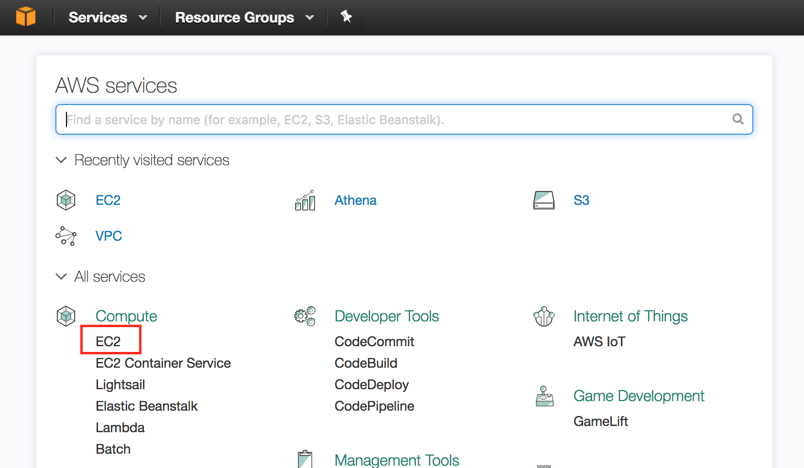

1. Click on Launch Configuration in the AUTO SCALING section near the bottom of the leftmost menu. This will display a 
page that walks you through the steps of creating your launch configuration.

    
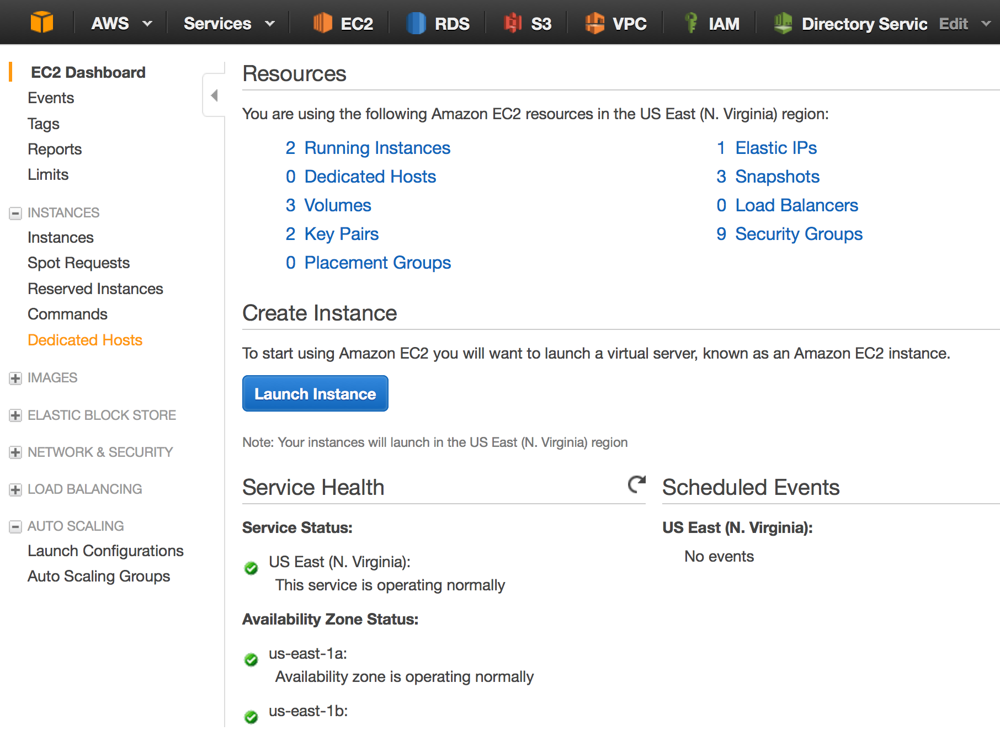

1. To create a new Launch Configuration, click the Create Auto Scaling Group button under the "Welcome to Auto Scaling" 
section at the top of the browser window.

    
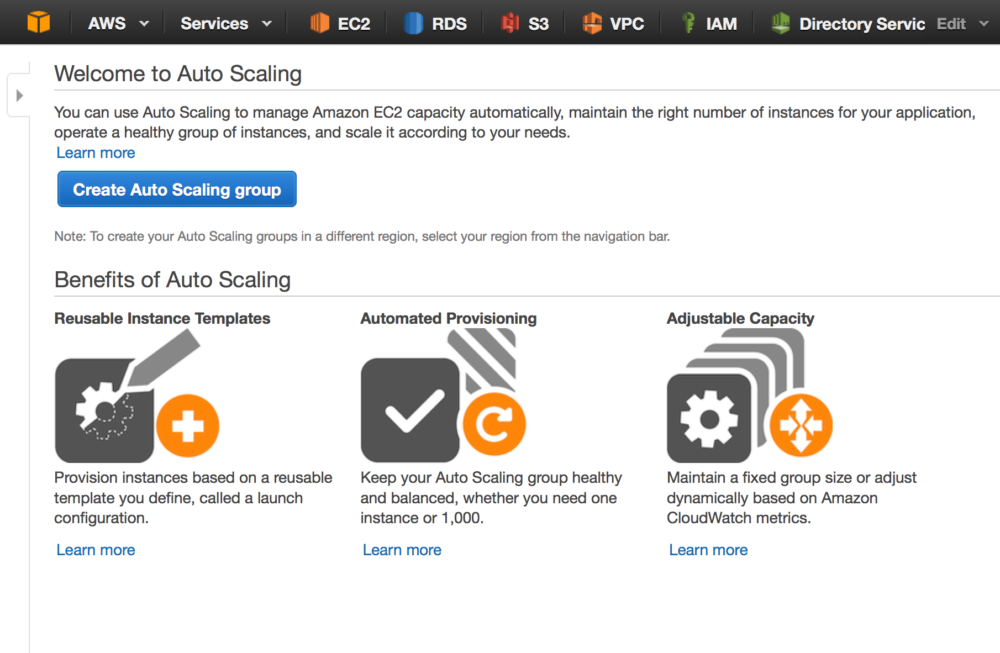

1. Select Create Launch Configuration at the bottom right hand side of the screen

    
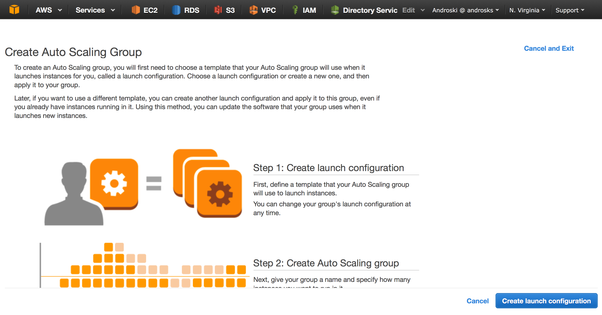

1. Select the Amazon Machine Image (AMI) that you would like to use

    > NOTE: This AMI can be an image of a machine that has the applications, scripts and configurations that it will 
    need to be of value to you and your customers. Or, it can be a fresh copy of an Amazon AMI that will run a script 
    that has been tailored to meet your needs.

    
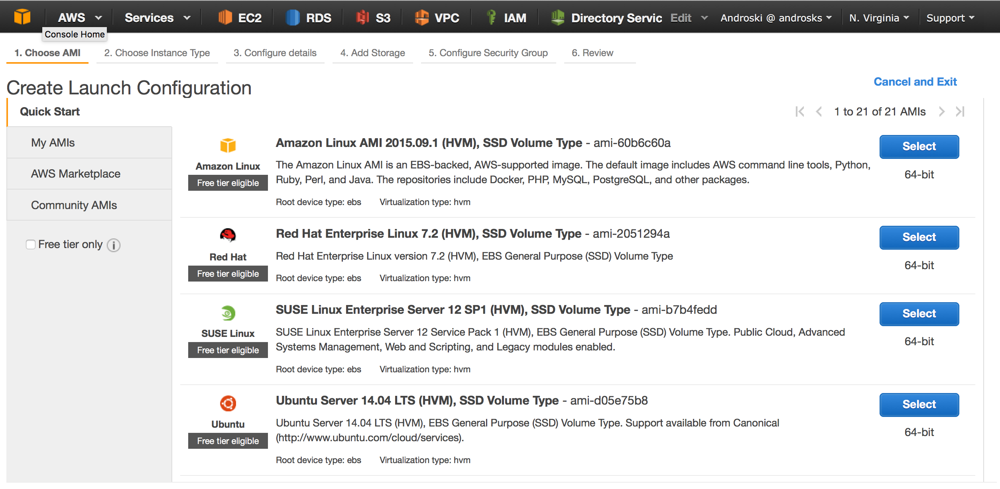

1. Select the Instance Type and then click the Next Configure Details button

    
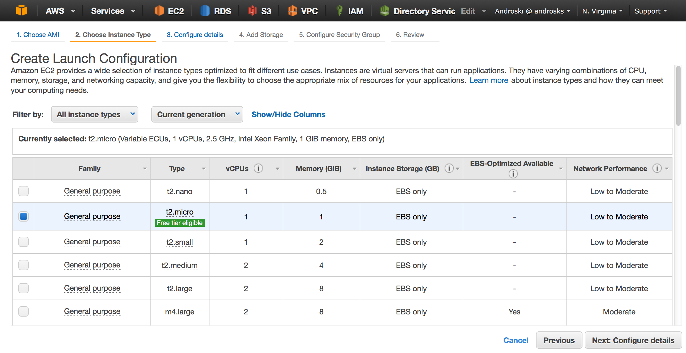

1. In the Configure Details screen, you must add a name for your configuration. The other fields can be left as is or 
you can modify them to fit your use case. For example, if you have a requirement for these machines to run a script that 
installs applications and start services then its important that you add your script to the User Data section of the page.

    
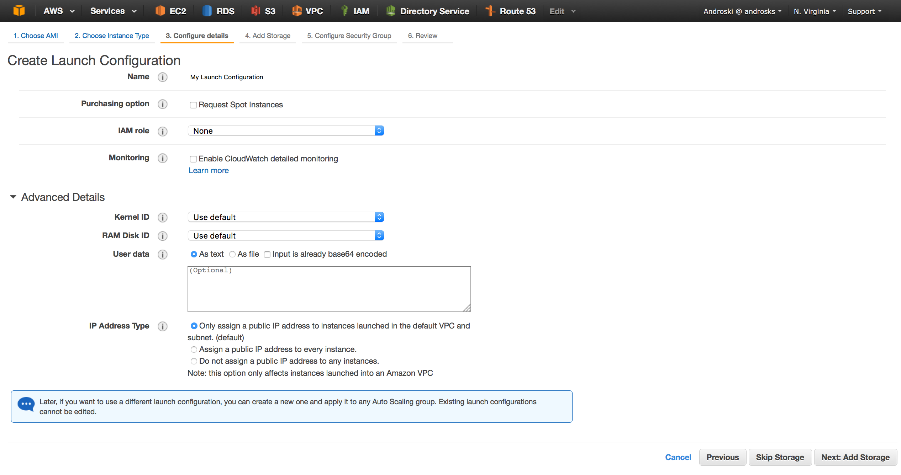

1. In a production environment you might want to add storage base on your requirements. In that scenario you would 
specify the EBS volume type, size and termination requirement. For the purposes of this lab, we will not add any 
additional volumes and we will select "Delete on Termination" for the Root volume. Up on completion of doing so, select 
"Next Configure Security Group"

    
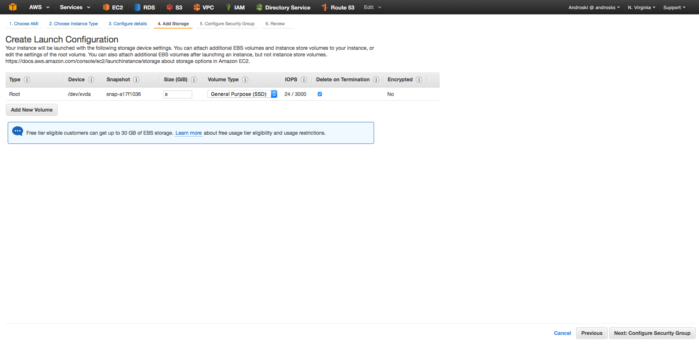

1. In a production scenario you might chose a Secruity Group from that already exist. For the purposes of this lab we 
will create a new Security Group. Select "Create a New Security Group" and add the port/s that your application and users 
need.

    
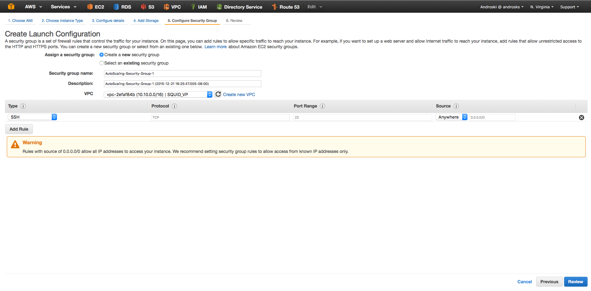

1. Click the Review button at the bottom of the page to ensure that all components of your Launch Configuration are 
correct.

1. Click the Create Launch Configuration button to create your Launch Configuration

    
 NOTE: Please note that you will need to provide a key pair to use when launching instances with this launch 
    configuration. In a production environment you might have one but for the purposes of this exercise you are required 
    to create one. Please ensure that you do.

## Create Your Auto Scaling Group

In this section we are going to create an Auto Scaling Group. An Auto Scaling Group is contains a collection of EC2 
Instances that share similar characteristics. For example, an Auto Scaling Group for a web server farm can assist of a 
fleet of Apache Web Servers. Ideally, all servers within this farm would be stateless and contain the same scripts, 
configuration, applications, and files and connect to the same caching resources and/or databases.

When you create an Auto Scaling Group, you must specify a name, launch configuration, minimum number of instances, 
maximum number of instances and your desired capacity. The minimum number of instances is the lowest number of instances 
that your Auto Scaling Group will run at. The maximum number of instances sets the ceiling on the highest number of 
instances that your Auto Scaling group will scale to. The desired capacity is the number of instances that you would 
like your Auto Scaling Group to have.

When you launch your Auto Scaling Group, it will be launched with your desired capacity if one has been set, if not, it 
will be launched with the number of instances that you defined.

If you do not add a scaling policy to your Auto Scaling configuration, then Auto Scaling will maintain your desired 
number of instances at all times.

1. Sign into the AWS Management Console and open the Amazon EC2 console at <https://console.aws.amazon.com/ec2>.

1. Click Auto Scaling Groups in the lower right hand of the console Click the Create Auto Scaling Group button 

    
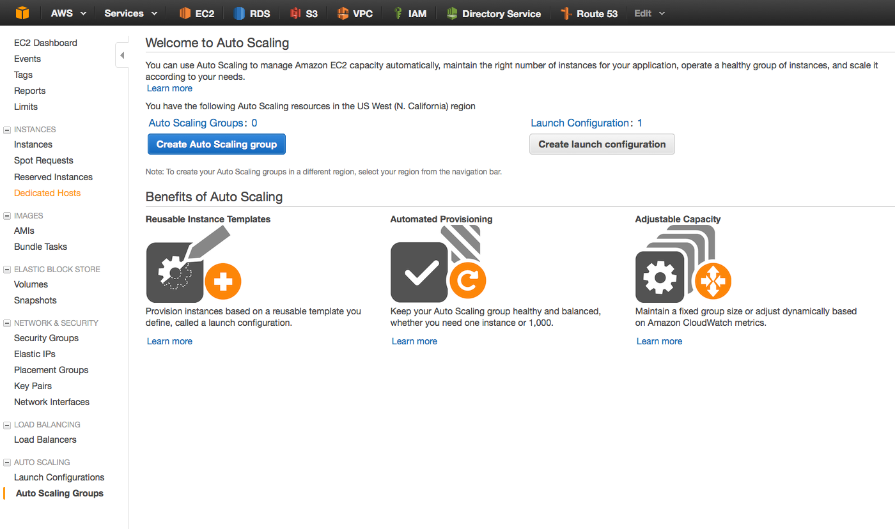

1. Select Create an Auto Scaling group from an existing launch configuration and then select the launch configuration 
you created in the previous exercise. Click the Next button at the bottom right hand side of the screen.

    
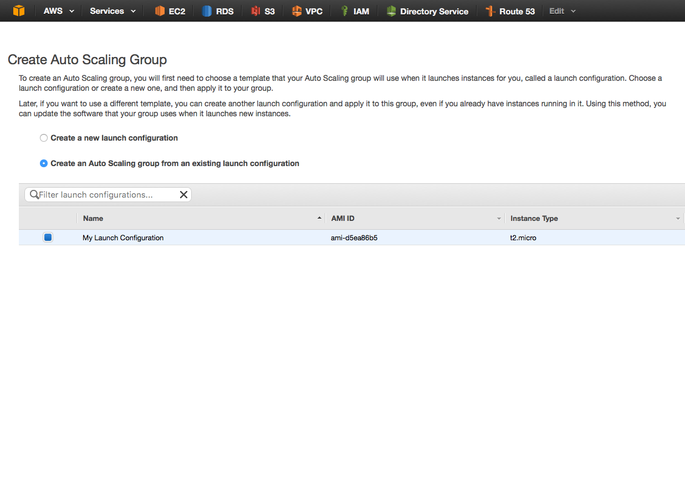

1. In the screen below Add the name of your Auto Scaling Group, the VPC that this group will be operating in and the 
subnets in which EC2 instances will be added to or remove from. Specify the size of the Auto Scaling Group you would 
like to start with. This sets the number of instances the Group should have at anytime. The Auto Scaling Group size is 
also known as the Desired Capacity

    In the Advance Details section of this page you have the option to associate an Elastic Load Balancer to your Auto 
    Scaling Group. If you associate an Elastic Load Balancer (ELB) to the Auto Scaling Group then all newly instantiated 
    instances will register themselves with the Load Balancer and the ELB will distribute incoming application traffic 
    (evenly or unevenly) across the EC2 instances in your Auto Scaling Group.
    
    Please note that while Auto Scaling and the Elastic Load Balancing service works together to provide you with a fault 
    tolerant and highly available environment you can opt to build your Auto Scaling Group without an ELB.
    
    The Health Check Grace period can be modify to fit your environment needs. The default timer is 300 seconds. This is the 
    length of time that Auto Scaling will wait before checking the status of the instance.

    
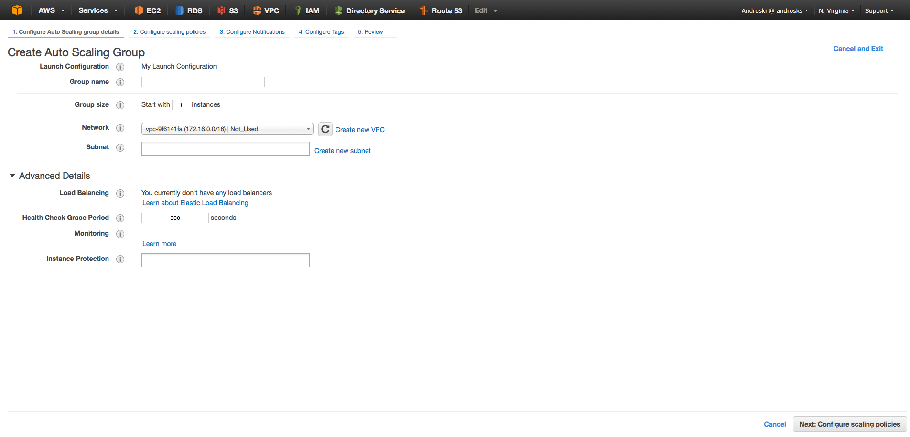

1. The second exercise in the process of creating your Auto Scaling Group is to configure your scaling policies. A 
scaling policy is a set of instructions for making adjustments to your group size. An adjustment is generally made in 
response to an Amazon CloudWatch alarm that you assign the scaling policy.
    
    When defining a policy, you can chose to increase or decrease the number or percentage of instances in your Auto Scaling 
    Group or you can chose to keep the group at a speciifc size.
    
    Amazon offers two types of scaling policies, a simple policy and an intuitive policy that scales in steps. The simple 
    policy only has one step define, for example, when CPU is at 50%, increase or decrese my number of instances to "X". 
    The intuitive scaling policy allows you to add several number of steps. Auto Scaling will check these steps and scale 
    your Auto Scaling Group according to the conditions you defined in these steps.
    
    Select Use scaling policies to adjust the capacity of this group to build a Scaling Policy that automatically increases 
    or decrease the size of your group when a Cloud Watch alarm is triggered. There are two options here, you can chose the 
    step method which scales your group up or down when different variation of your threshold are breached. The other option 
    is to implement a simple scaling policy that simply adds or remove a number of instances when an alarm is triggered.

    
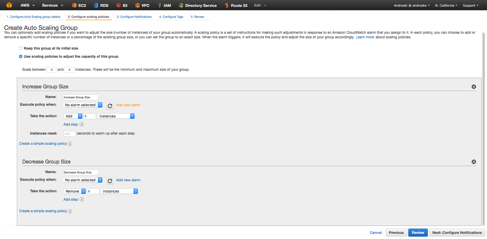

1. Click the Add Notification button

    
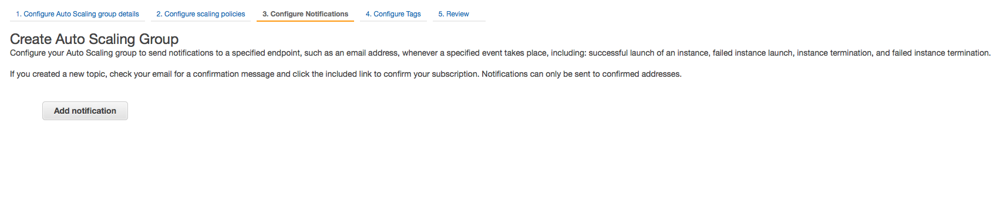

1. Add a notification topic, the recipients who need to be notified and the events that will trigger this notification. 
In a real world scenario you may already have a notification that was created. In that scenario you can select the "Use 
existing topic" hyper link. For the purposes of this lab we are going to create a notification message and then click 
the "Add Notification" button

    
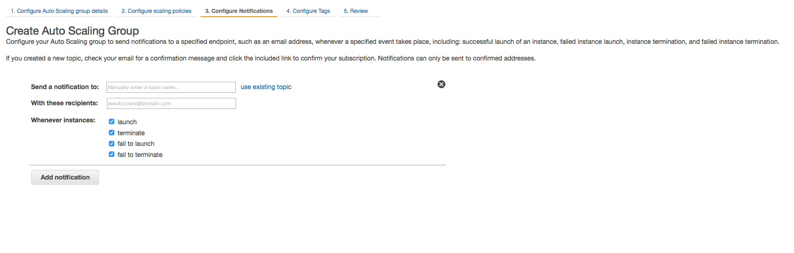

1. Click the Review button. Ensure that all component are configured as desired and then Click the  
button at the bottom of the screen to launch your Auto Scaling Group.

1. Once your autoscaling group is create, go back to the EC2 console and select Auto Scaling Group at the bottom left 
hand side of the screen.

    Once selected you will be able to view your Auto Scaling Group and make changes to it. The Auto Scaling console will 
    list the name of your group, the associated launch configuration, the subnets and the cool down and health check timers.

    
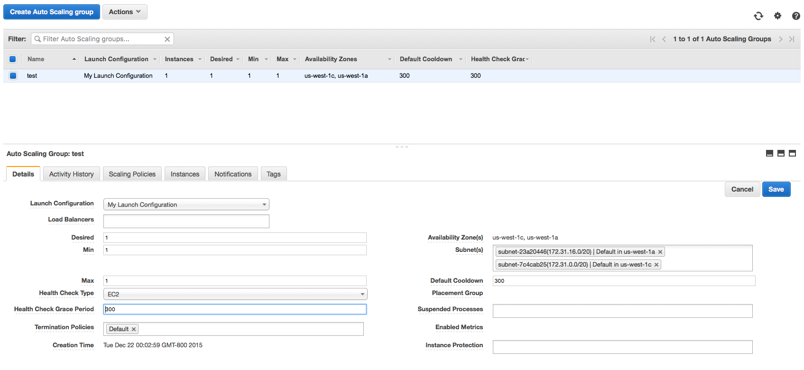

1. To make changes to your Auto Scaling Group. Select the group, then Action and then edit.

## Additional Reading 

* [Amazon Auto Scaling](http://docs.aws.amazon.com/AutoScaling/latest/DeveloperGuide/WhatIsAutoScaling.html)
* [Amazon Elastic Load Balancing](http://docs.aws.amazon.com/ElasticLoadBalancing/latest/DeveloperGuide/elastic-load-balancing.html)
* [Amazon Virtual Private Cloud](http://docs.aws.amazon.com/AmazonVPC/latest/UserGuide/VPC_Introduction.html)
* [Amazon EC2 Instances - EC2 for Linux](http://docs.aws.amazon.com/AWSEC2/latest/UserGuide/concepts.html)
* [Amazon EC2 Instances - EC2 for Windows](http://docs.aws.amazon.com/AWSEC2/latest/WindowsGuide/concepts.html)
