# AWS CloudFormation

This lab will walk the user through using the AWS CloudFormation to create a VPC with public and private subnets, describe 
each of the objects created by the AWS CloudFormation, and launch VPC with the public and private VPC subnets, RouteTable, 
Elastic IP NAT Gateway, and S3 bucket.

The following is a high-level overview of this lab:

* Explore the initial AWS CloudFormation template 
* Explore the different VPC objects and what they mean 
* Launch AWS CloudFormation by creating Stack from Console. 
* Export VPC ID, NAT Gateway ID and S3 bucket URL to output tab

The lab will provide an initial template for users to explore. After creating VPC stack from an initial template, users 
need to complete provided objective to achieve the final solution.

* [Explore Initial VPC template](#explore-initial-vpc-template)
* [Create Stack](#create-stack)
* [Lab Objective](#lab-objective)
* [References](#references)
* [Update Stack and Solution](#update-stack-and-solution)

> NOTE: Screenshots are provided to guide you through the steps in the lab. The elements that you will create (e.g. VPC, 
NAT Gateway, EIP) will be unique to your account, so things such as VPC ID that you see in the console will not 
necessarily mirror what's seen in the screenshot.

## Explore Initial VPC template

Please browse the initial AWS CloudFormation Template file, You can use any text editor to explore the different elements 
of VPC mentioned in the template:

[Lab_Initial_CloudFormation_Module_General_ImmersionDay.yaml](./Lab_Initial_CloudFormation_Module_General_ImmersionDay.yaml)

You will notice following resources in Initial AWS CloudFormation Template:

* VPC
* Internet Gateway
* S3 bucket
* Two public subnets with corresponding route tables
* Two private subnets with corresponding route tables
* Two Elastic IP
* Two NAT Gateway

## Create Stack

Log into the **AWS Console**, and click on **CloudFormation** and below screen will open:

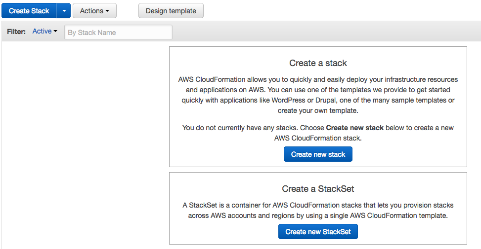

Now click on **Create new stack** and browse your initial template to against choose a template option:

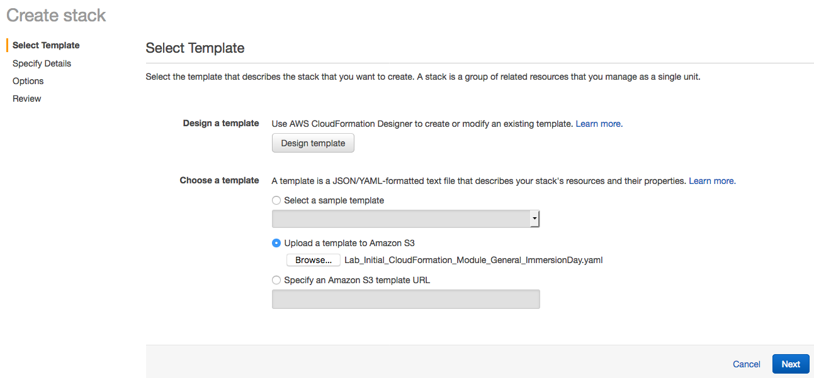

Click **Next** and give stack name. Make sure your stack name should be unique to your account. Leave all other option 
as default

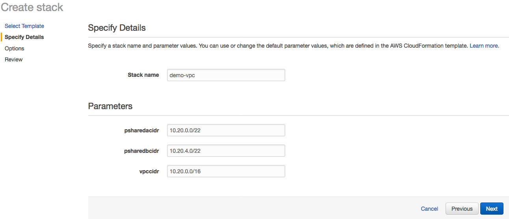

Click **Next**, here you can define a tag for the stack, IAM Role and other advance option like termination protection 
and rollback trigger. For this lab we will leave this as it and click to **Next** again, where you will have the 
opportunity to review your stack settings:

Now Click on **Create** and you will notice your stack creation started with status **CREATE_IN_PROGRESS.** Explore the 
**Events** tab where you can see the progress as your stack get created.

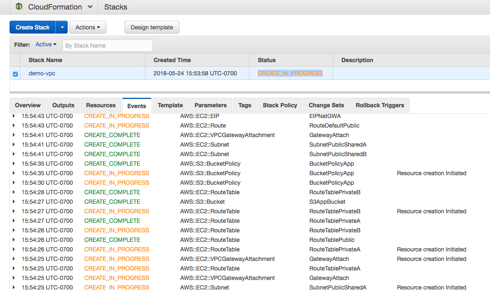

While you are waiting to explore all other tabs like **Template** tab to review your template and **Parameters** tab to 
see parameter value. You will also notice that **Outputs tab** is empty and you are going to modify your template to 
show values in Outputs tab.

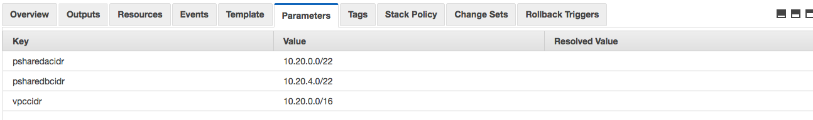

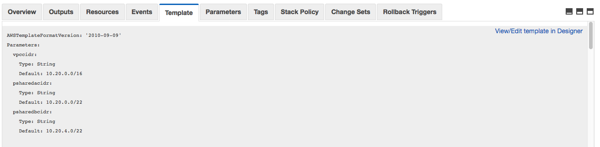

Once stack status changes to **CREATE_COMPLETE,** you can visit **Resources** tab to see all the resources got created 
by this AWS CloudFormation template.

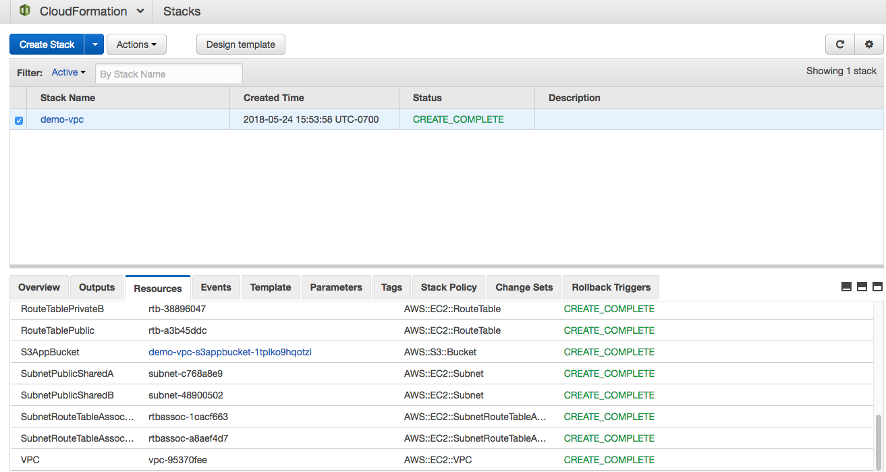

You can click on Amazon S3 bucket link shown in **Resources** tab and explore the bucket.Also, go to VPC from the console 
and explore different resources got created from AWS CloudFormation stack.

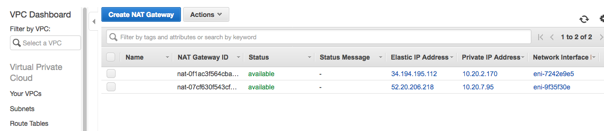

## Lab Objective

Now you need to modify your template with following objectives:

**Add Parameter Constraint:**

* Vpccidr
    * Minimum length should be set to 9
    * Maximum length should be set to 18
    * Allowed pattern should be: \"(\\\\d{1,3})\\\\.(\\\\d{1,3})\\\\.(\\\\d{1,3})\\\\.(\\\\d{1,3})/(\\\\d{1,2})\"
    * Add a constraint description

* Psharedacidr
    * Minimum length should be set to 9
    * Maximum length should be set to 18
    * Allowed pattern should be: \"(\\\\d{1,3})\\\\.(\\\\d{1,3})\\\\.(\\\\d{1,3})\\\\.(\\\\d{1,3})/(\\\\d{1,2})\"
    * Add a constraint description

* Psharedbcidr
    * Minimum length should be set to 9
    * Maximum length should be set to 18
    * Allowed pattern should be: \"(\\\\d{1,3})\\\\.(\\\\d{1,3})\\\\.(\\\\d{1,3})\\\\.(\\\\d{1,3})/(\\\\d{1,2})\"
    * Add a constraint description

**Add delete policy constraint :**

* Create a Deletion Policy for your S3 bucket to be Retained at deletion

**Add Outputs section to show value in Output tab:**

* Vpc id
    * Create a description of your output
    * Reference your VPC as the value using !Ref

* NATGWA
    * Create a description of your output
    * Reference your NAT gateway A as the value using !Ref

* NATGWB
    * Create a description of your output
    * Reference your NAT gateway B as the value using !Ref

* App bucket URL
    * Create a description of your output
    * Reference your S3 bucket URL as the value using !Ref

**Add export values in Outputs section for Cross-Stack Reference:**

* Vpc id
    * Export your vpcid Name as 'sharedinf-vpc'

* App bucket URL
    * Export your appbucketurl Name as 'sharedinf-appbucketurl'

## References

* [Parameters](https://docs.aws.amazon.com/AWSCloudFormation/latest/UserGuide/parameters-section-structure.html)
* [Intrinsic functions](https://docs.aws.amazon.com/AWSCloudFormation/latest/UserGuide/intrinsic-function-reference.html)
* [Outputs and Export](https://docs.aws.amazon.com/AWSCloudFormation/latest/UserGuide/outputs-section-structure.html)
* [Mappings](https://docs.aws.amazon.com/AWSCloudFormation/latest/UserGuide/mappings-section-structure.html)
* [Deletion policy](https://docs.aws.amazon.com/AWSCloudFormation/latest/UserGuide/aws-attribute-deletionpolicy.html)

## Update Stack and Solution

Once you modified your existing template , you can use **Update Stack** option to update your stack. To update select 
your Stack and click on **Actions drop down and you will find Update Stack** option.

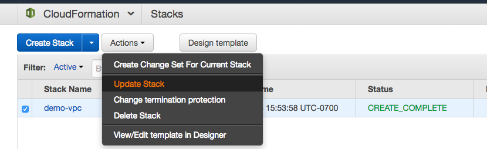

In **Update**, Stack screen select browse your updated template. If you have not figured out a solution yet Follow 
instruction in appendix section to get template

[Lab_Solution_CloudFormation_Module_General_ImmersionDay.yaml](Lab_Solution_CloudFormation_Module_General_ImmersionDay.yaml)

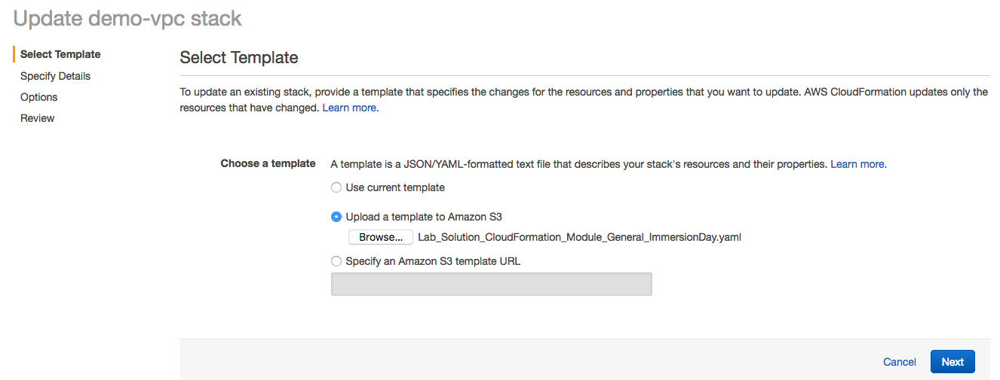

Now remaining steps are same as you followed in Create stack. Click Next couple of time and you will land up to review 
summary screen, where you need to click on **Update** button:

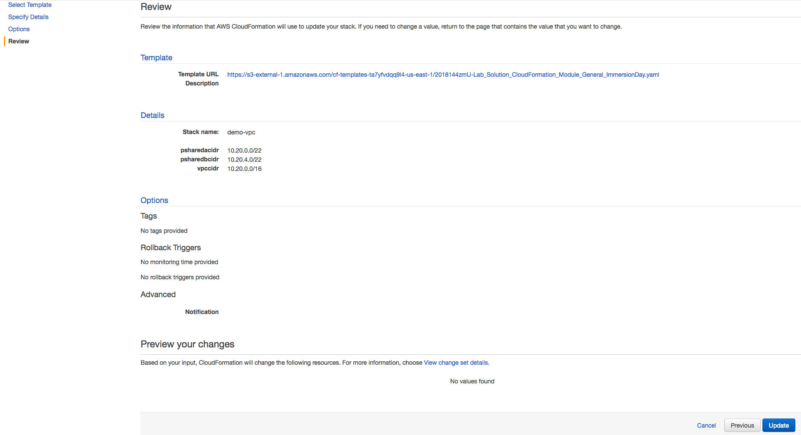

Now you will find your stack status changed to **UPDATE_IN_PROGRESS** and **Events** tab showing the activity performed 
using update stack.

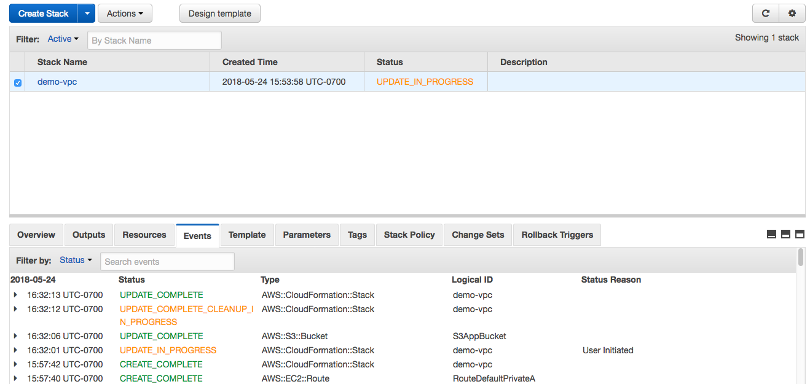

Once stack status changed to UPDATE_COMPLETE status, you can browse to **Outputs** tab and find out our changes has 
reflected now Outputs tab has four values compare to earlier it was empty:

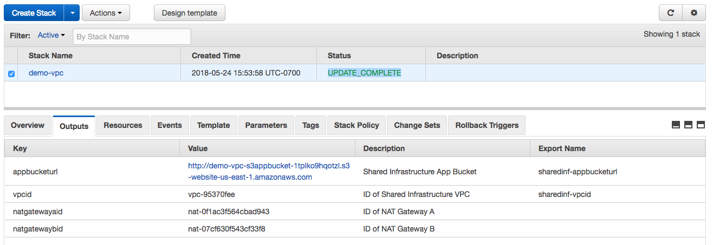

Also, click on **CloudFormation** icon on the right top corner of the screen and select **Exports** option**,** you will 
find two exported value shown in here which can be utilized for cross-stack reference.

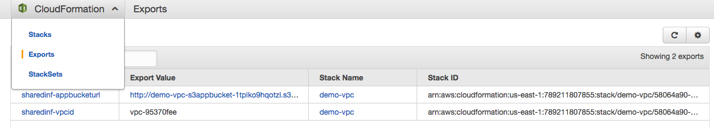

To create a cross-stack reference, use the **Export** output field to flag the value of a resource-output for export. 
Then, use the **Fn::ImportValue** intrinsic function to import the value.
