# Amazon Elastic Cloud Computing (Amazon EC2)

<p align="center"></p>

Amazon Elastic Compute Cloud (Amazon EC2) is a web service that provides resizable compute capacity in the cloud. Amazon 
EC2"s simple web service interface allows you to obtain and configure capacity with minimal friction. Amazon EC2 reduces 
the time required to obtain and boot new server instances to minutes, allowing you to quickly scale capacity, both up 
and down, as your computing requirements change. Amazon EC2 changes the economics of computing by allowing you to pay 
only for capacity that you actually use.

This lab will walk you through launching, configuring, and customizing an EC2 virtual machine to run a web server. It 
will walk you though successfully provisioning and starting an EC2 instance using the AWS Management Console.

* [Create a new Key Pair](#create-a-new-key-pair)
* [Launch a Web Server Instance](#launch-a-web-server-instance)
* [Browse the Web Server](#browse-the-web-server)
* [Appendix -- Additional EC2 Concepts](#appendix----additional-ec2-concepts)
* [Change the Instance Type](#change-the-instance-type)
* [Black Belt Booting](#black-belt-booting)
* [Appendix B -- SSH to EC2 instances using MindTerm](#appendix-b----ssh-to-ec2-instances-using-mindterm)
* [Appendix C -- Using a 3^rd^ Party SSH Client](#appendix-c----using-a-3^rd^-party-ssh-client)
* [Windows (PuTTY)](#windows-(putty))
* [Mac OS X or Linux (OpenSSH)](#mac-os-x-or-linux-(openssh))

## Create a new Key Pair

In this lab, you will need to create an EC2 instance using an SSH keypair. The following steps outline creating a unique 
SSH keypair for you to use in this lab.

1. Sign into the AWS Management Console and open the Amazon EC2 console at <https://console.aws.amazon.com/ec2>.

1. In the upper-right corner of the AWS Management Console, confirm you are in the desired AWS region (e.g., Oregon).

1. Click on Key Pairs in the NETWORK & SECURITY section near the bottom of the leftmost menu. This will display a 
page to manage your SSH key pairs.

    <p align="center">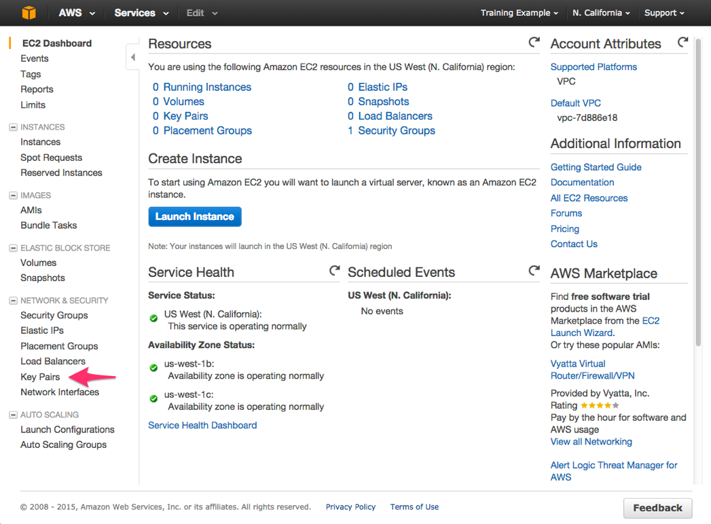

1. To create a new SSH key pair, click the Create Key Pair button at the top of the browser window.

    <p align="center">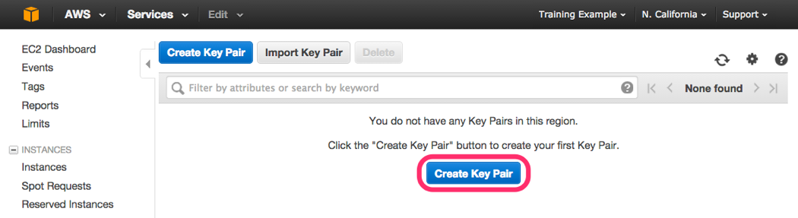

1. In the resulting pop up window, type \[First Name\]-\[LastName\]-ImmersionDay into the Key Pair Name: text box and 
click Create.

    <p align="center">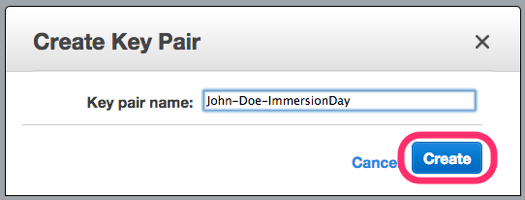

1. The page will download the file "\[Your-Name\]-ImmersionDay.pem" to the local drive. Follow the browser instructions 
to save the file to the default download location.

1. Remember the full path to the file .pem file you just downloaded.

> NOTE: You will use the Key Pair you just created to manage your EC2 instances for the rest of the lab.

## Launch a Web Server Instance

In this example we will launch a default Amazon Linux Instance with an Apache/PHP web server installed on initialization.

1. Click EC2 Dashboard towards the top of the left menu.

1. Click on Launch Instance

    <p align="center">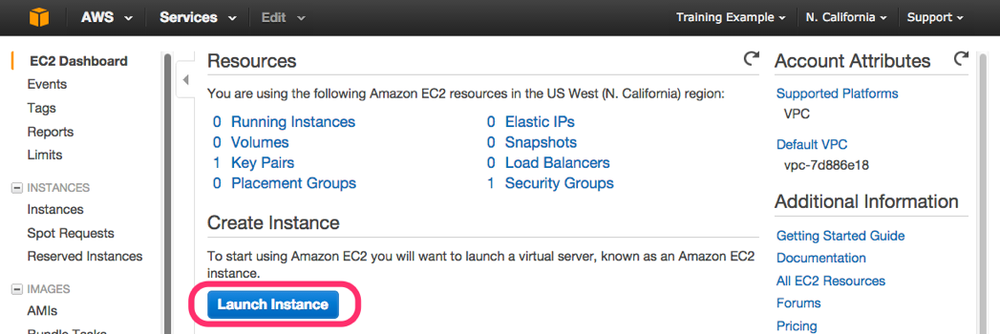

1. In the Quick Start section, select the first Amazon Linux AMI and click Select

    <p align="center">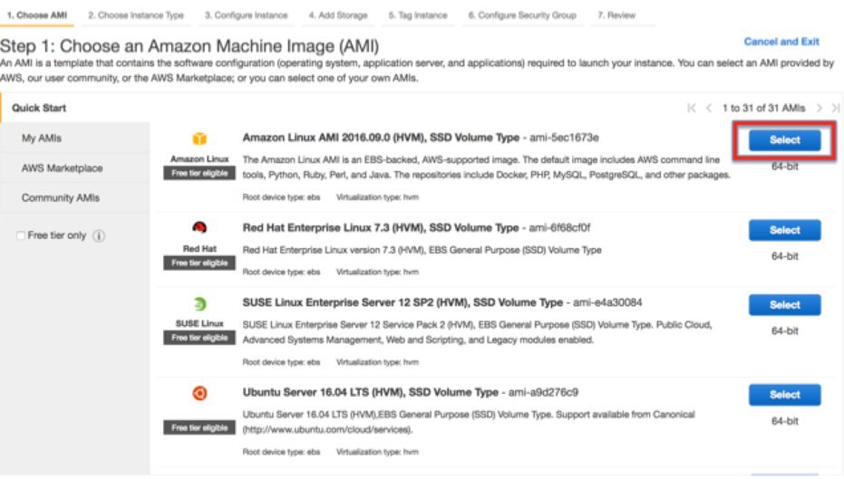

1. Select the General purpose t2.micro instance type and click Next: Configure Instance Details
  
    <p align="center">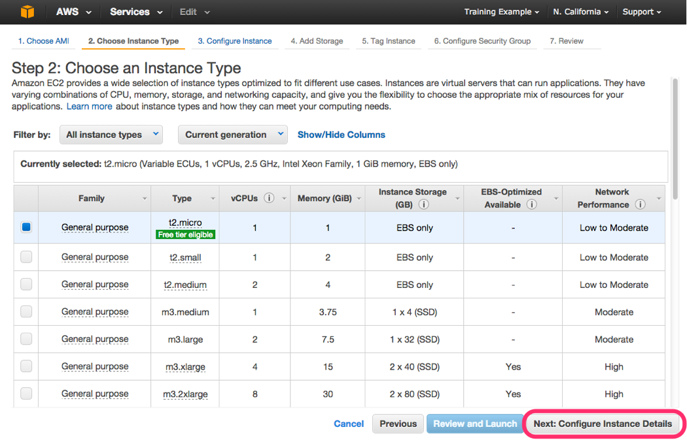

1. On the Configure Instance Details page, expand the Advanced Details section at the bottom of the page, and type the 
following initialization script information (you can use Shift-Enter to create the necessary line break, or alternatively 
you could type this into Notepad and copy & paste the results) into the User Data field (this will automatically install 
and start the Apache web server on launch) and click Next: Add Storage :

    ```
    #include
    https://awstechbootcamp.s3.amazonaws.com/bootstrap.sh
    ```
    
    [bootstrap.sh](./bootstrap.sh)
    
    <p align="center">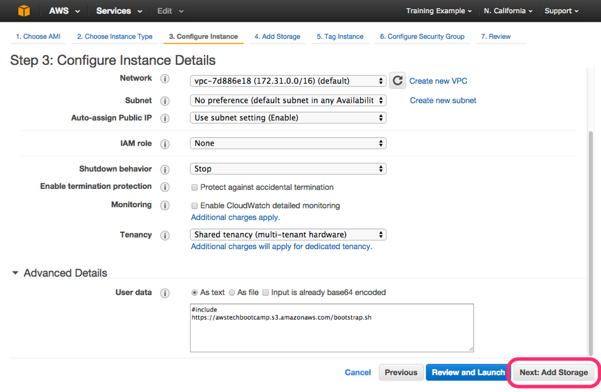

1. Click Next: Tag Instance to accept the default Storage Device Configuration.

    <p align="center">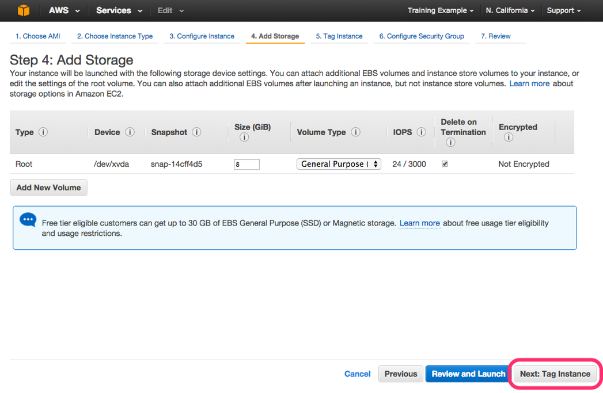

    Next, choose a "friendly name" for your instance. This name, more correctly known as a tag, will appear in the 
    console once the instance launches. It makes it easy to keep track of running machines in a complex environment. 
    Named yours according to this format: "\[Your Name\] Web Server.
    
    Then click Next: Configure Security Group.

    <p align="center">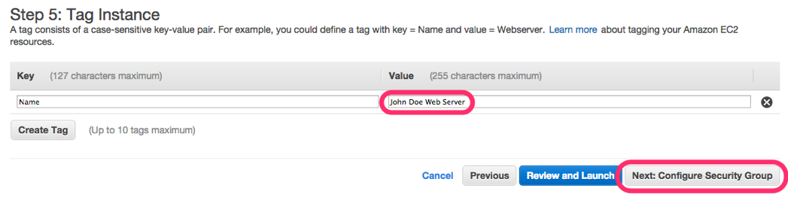

1. You will be prompted to create a new security group, which will be your firewall rules. On the assumption that we are 
building out a Web server, name your new security group "\[Your Name\] Web Tier", and confirm an existing SSH rule exists 
which allows TCP port 22 from anywhere. Click Add Rule:

1. Select HTTP from the Type dropdown menu, and confirm TCP port 80 is allowed form anywhere. Click Add Rule.

1. Click the Review and Launch button after configuring the security group.

    <p align="center">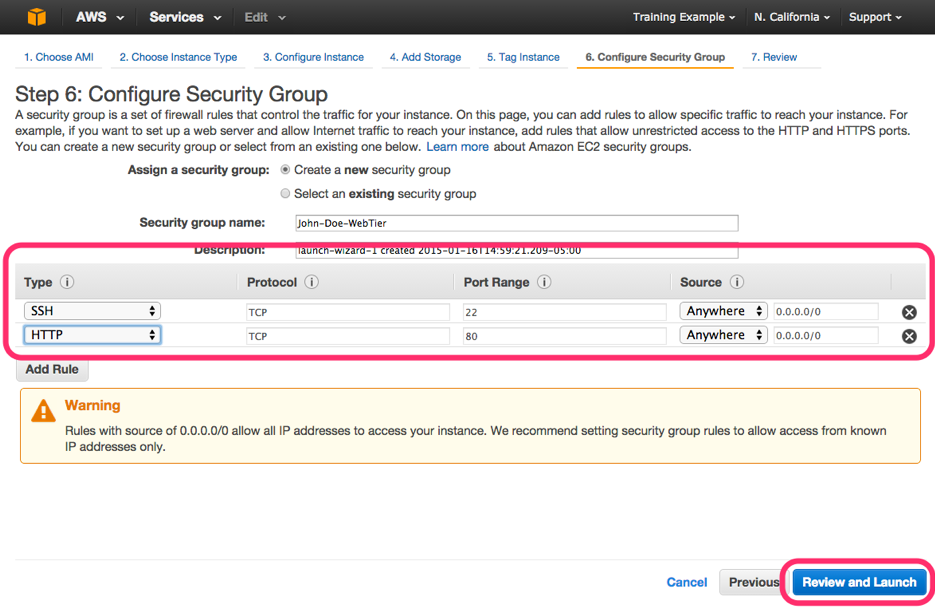

1. Review your choices, and then click Launch.

    <p align="center">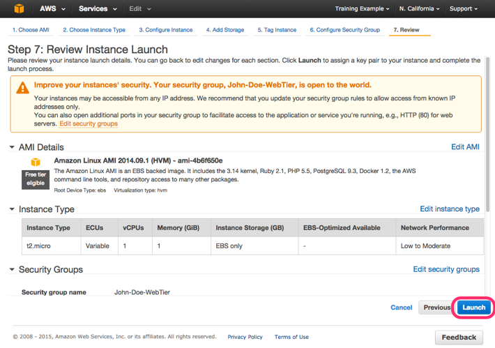

1. Select the \[YourName\]-ImmersionDay key pair that you created in the beginning of this lab from the drop and check 
the \"I acknowledge\" checkbox. Then click the Launch Instances button.

    <p align="center">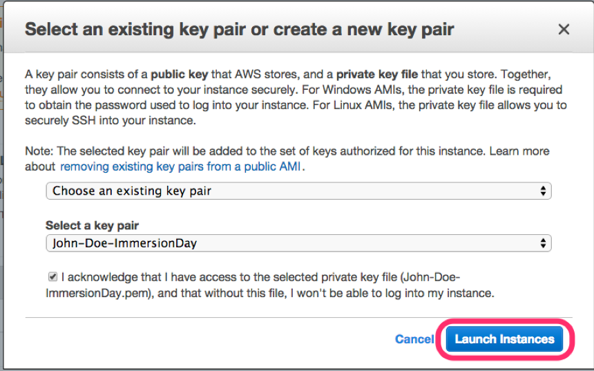

1. Click the View Instances button in the lower righthand portion of the screen to view the list of EC2 instances. Once 
your instance has launched, you will see your web Server as well as the Availability Zone the instance is in and the 
publicly routable DNS name.

1. Click the checkbox next to your web server name to view details about this EC2 instance.
  
    <p align="center">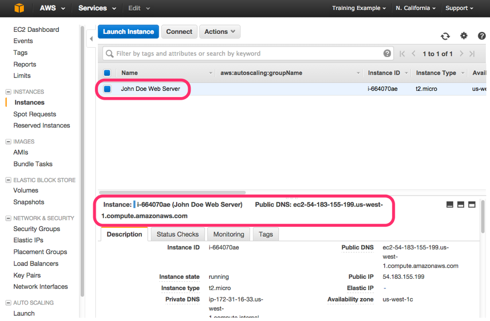

## Browse the Web Server

1. Wait for the instance to pass the Status Checks to finish loading.
  
    <p align="center">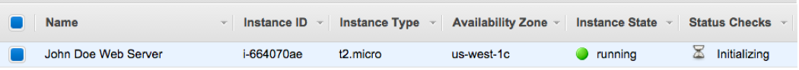
  
    Finished initializing
    
    <p align="center">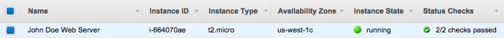

1. Open a new browser tab and browse the Web Server by entering the EC2 instance"s Public DNS name into the browser. The 
EC2 instance"s Public DNS name can be found in the console by reviewing the "Public DNS" name line highlighted above.

    You should see a website that looks like the following:

    <p align="center">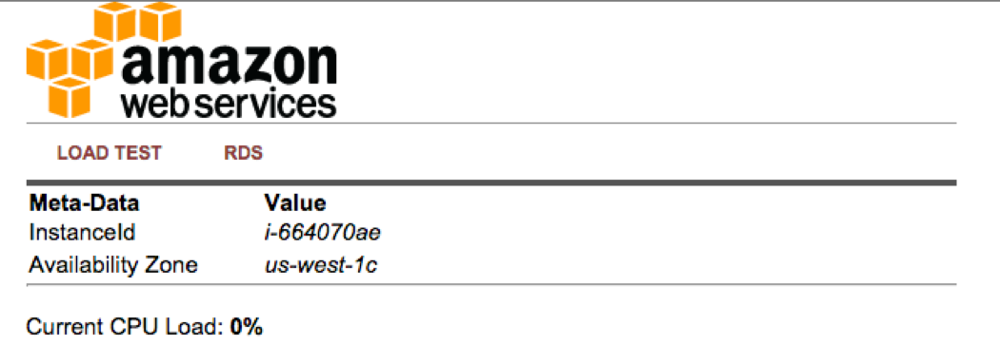

    Great Job! You have deployed a server and launched a web site in a matter of minutes!!
