# Elastic Load Balancing (ELB)

# Elastic Load Balancing (ELB)

This lab will walk the user through creating an ELB to load balance traffic across several EC2 nodes in a single 
Availability Zone.

> NOTE: This lab has a prerequisite of Immersion Day -- Getting Started with EC2 and assumes that you have already 
launched your first web server. This lab will demonstrate configuring a farm of web servers from the Immersion Day - 
Getting Started with EC2 lab to use ELB for its load balancing needs.

* [Launch a Second Web Server](#launch-a-second-web-server)
* [Create an ELB](#create-an-elb)

## Launch a Second Web Server

Let's launch another web server, similar to our existing web server instance.

1. Right click your web server and choose Launch More Like This. As it implies, this feature will launch another 
web server similar to the existing web server.

    
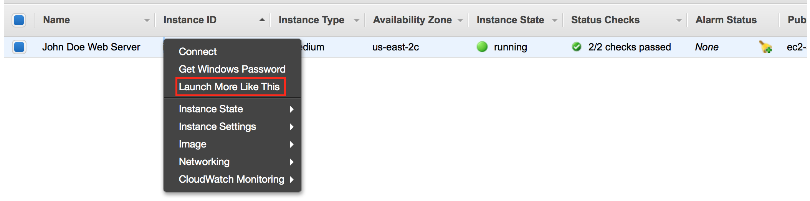

1. On the next screen, scroll down to the Tags section and click Edit Tags.

    
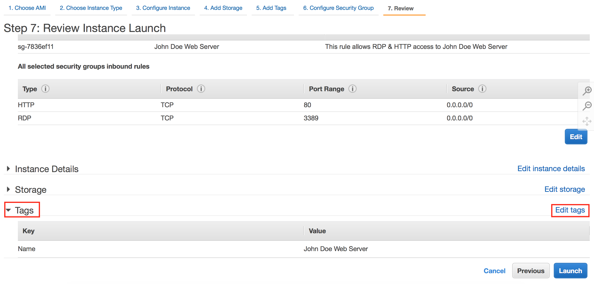

1. Change the Value of the Name tag to something different than the first instance, like \[Your name\] 
Webserver 2. Click Next: Configure Security Group

    
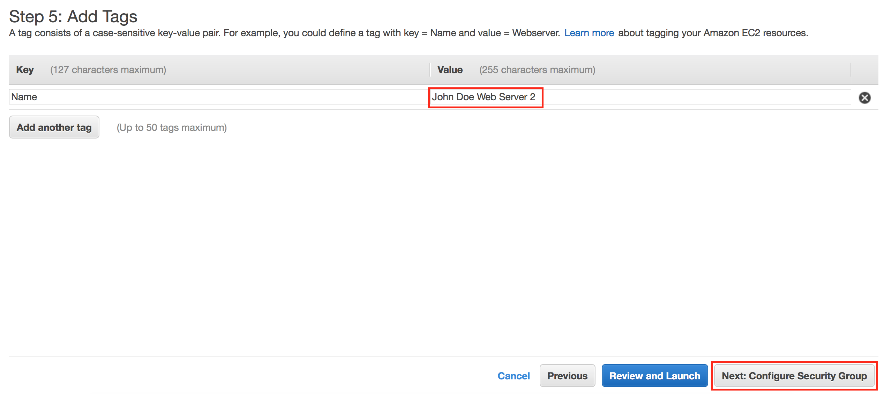

1. Click the Review and Launch button to continue to the next screen where you'll launch the additional server.

    
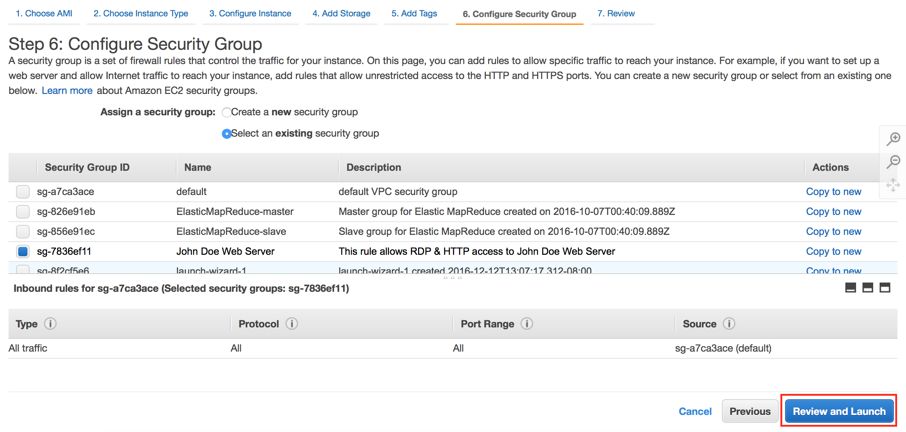

1. Click on Launch to launch your additional instance. Like your first instance, this newly launched instance will 
take a few minutes to boot and configure itself.

    
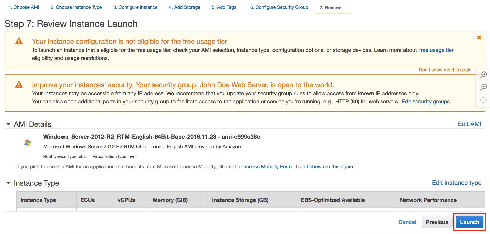

1. Please select the existing key pair that you created and click Launch Instances.

    
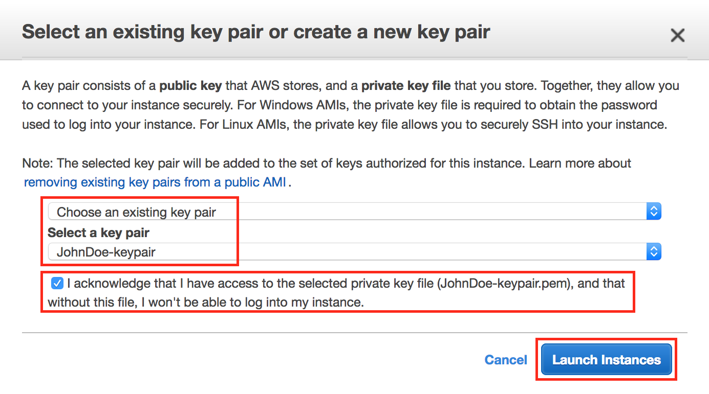

1. Once the second web server has passed its status checks, confirm the web server is operational by browsing to its web 
site using its public DNS. You'll see both instances listed in your console as shown below.

    
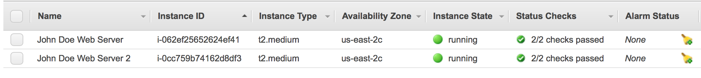

## Create an ELB

You now have two web servers, but you need a load balancer in front of these servers to give your users a single 
location for accessing both servers and to balance user requests across your web server farm.

1. Click on the Load Balancers link in the EC2 Console.

    
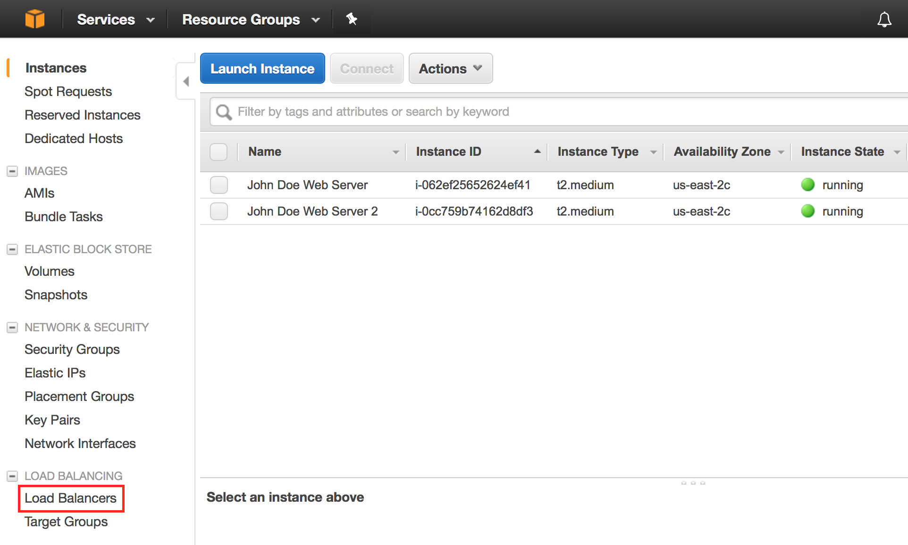

1. Click on Create Load Balancer button.

    
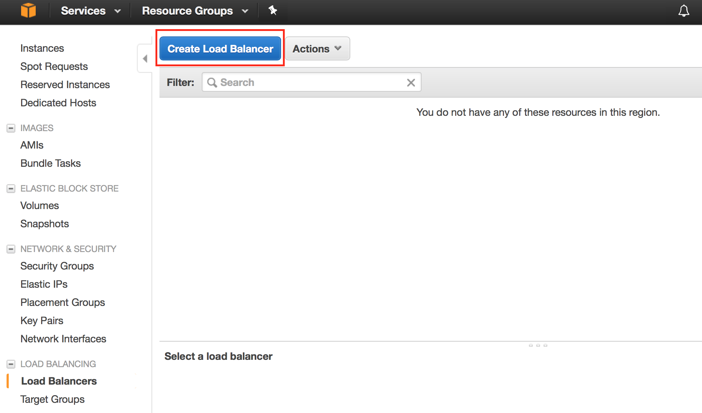

1. We will be creating a Classic Load Balancer today, so please select that option and click Continue to proceed to 
the next step.

    
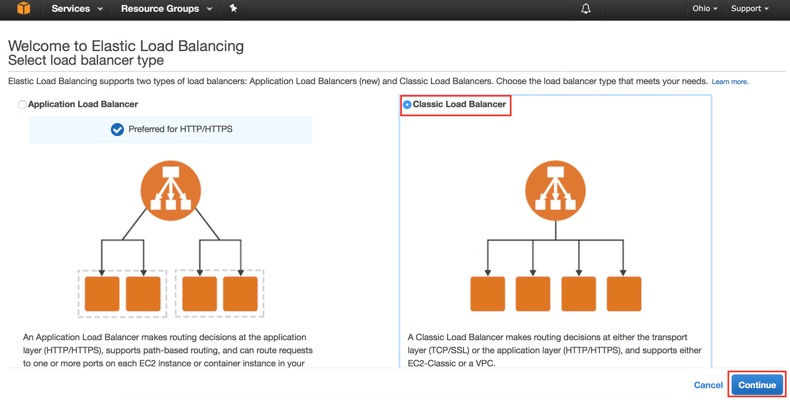

1. For the load balancer name, type a name like \[YourName\]-ELB, verify that HTTP is selected for the load balaner 
protocol, accept the default listener configuration, then click Next: Assign Security Groups.

    > NOTE: Please note that spaces are not allowed in the ELB name.

    
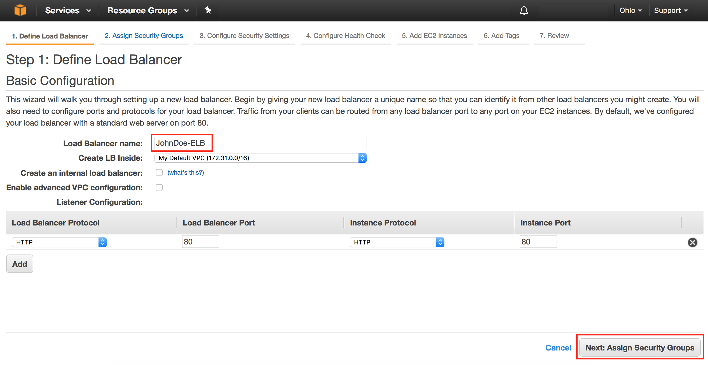

1. On the next screen we'll create a new security group for our ELB. Name your security group something like 
\[Your Name\] ELB SG, and allow HTTP traffic to be passed to your instances by creating a rule of type HTTP for 
port 80, then click Next:Configure Security Settings.

    
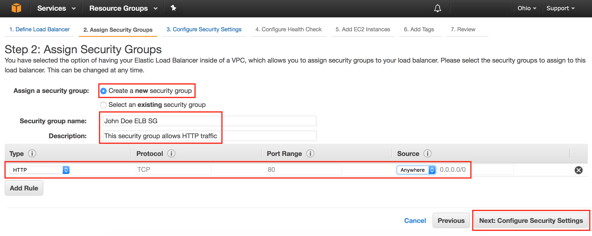

1. On the next screen you will see the warning below. This is becase we are setting up a HTTP service for this demo and 
not HTTPS. You can ignore this warning and click Next:Configure Health Check.

    
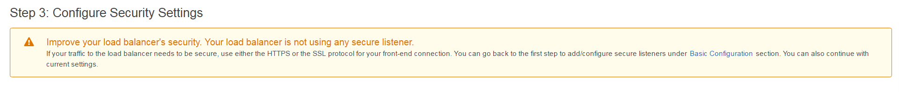

1. On the next screen change Ping Path to / (delete index.html), Healthy Threshold to 2 and accept the rest 
of the default options by clicking Next:Add EC2 Instances.

    
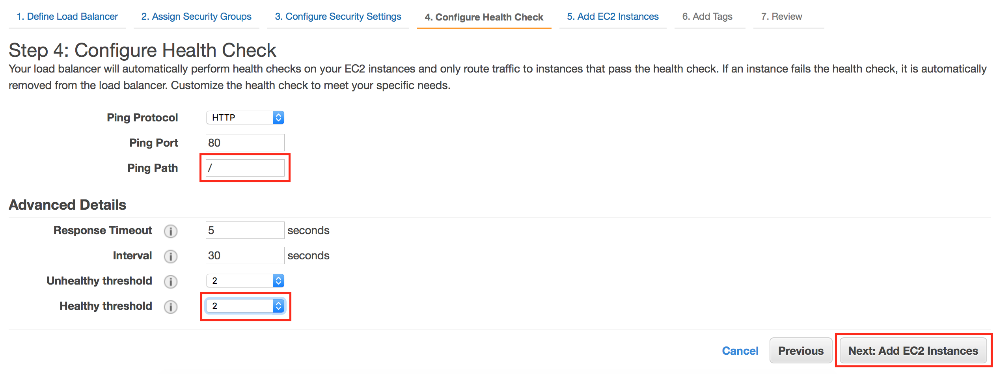

1. Select both your Web Servers you created to add them to your ELB and click Next:Add Tags.

    
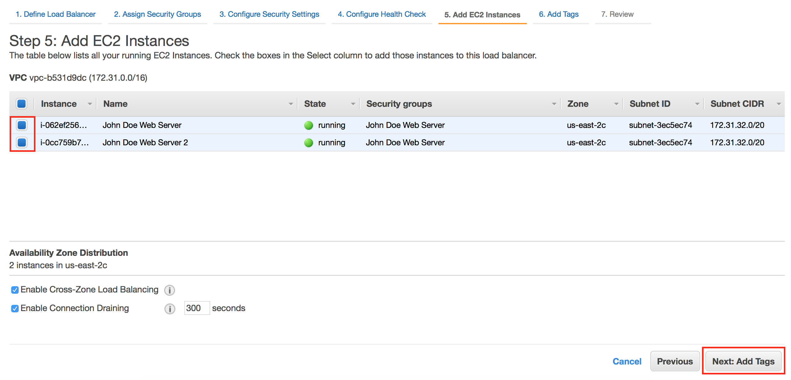

1. Tag your ELB with a Key of Name and a Value of \[YourName\] ELB and click Review and Create.

    
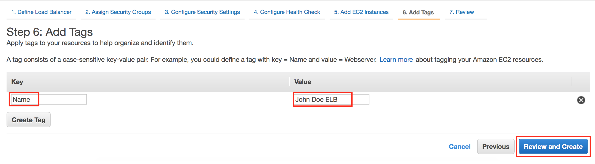

1. Review your ELB settings and click Create (followed by clicking Close).

1. AWS is now creating your ELB. It will take a couple of minutes to establish your load balancers, attach your web 
servers, and pass a couple of health checks. Click on your load balancer, select the Instances tab, and wait 
until the instances status changes from *Out of Service* to In Service. 

    

1. Once your ELB is healthy, click on the Description tab, select and copy the ELB's DNS name.

    
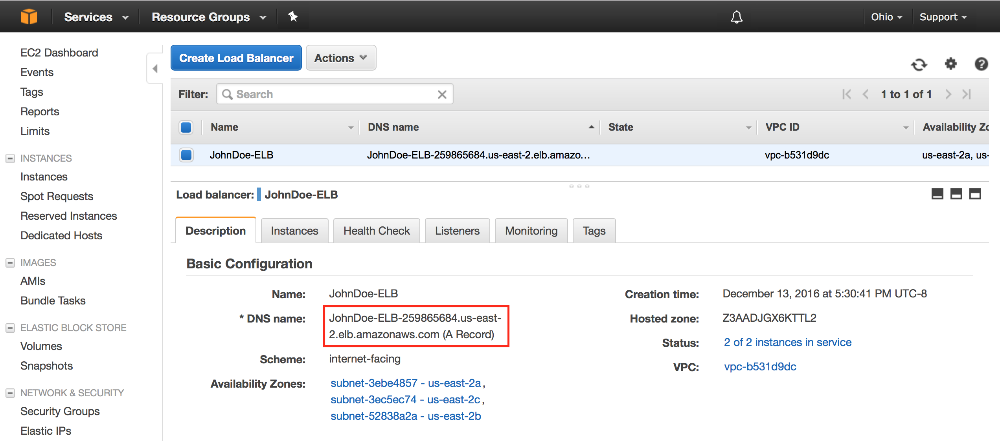

1. Open the ELB URL in a new browser tab. Hit the browser refresh button and you should cycle through your web servers 
(you may need to do a "Shift-F5" or "Shift-Refresh" as some browsers like Chrome are pretty aggressive in locally caching 
web pages).

    

    
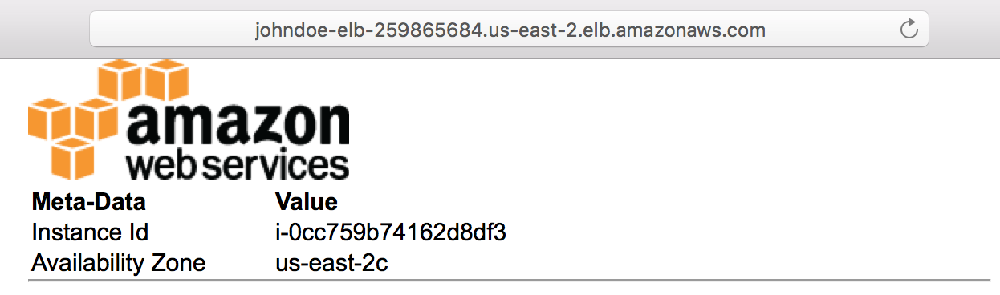

1. Congratulations, you've created a load balanced website.
