# AWS Identity and Access Management (IAM)

This lab will walk you through connecting to the instance and configuring security credentials so that you can interact with the AWS APIs and command line tools. This lab will cover the following topics:

* [Creating an IAM Group and adding an IAM user to the Group](#creating-an-iam-group-and-adding-an-iam-user-to-the-group)
* [Exploring the properties of an IAM User](#exploring-the-properties-of-an-iam-user)
* [Creating an IAM Role for EC2](#creating-an-iam-role-for-ec2)

## Creating an IAM Group and adding an IAM user to the Group

## Exploring the properties of an IAM User

## Creating an IAM Role for EC2

---

## Creating IAM Users and Groups

To generate AWS API credentials, go to IAM dashboard in the AWS console.

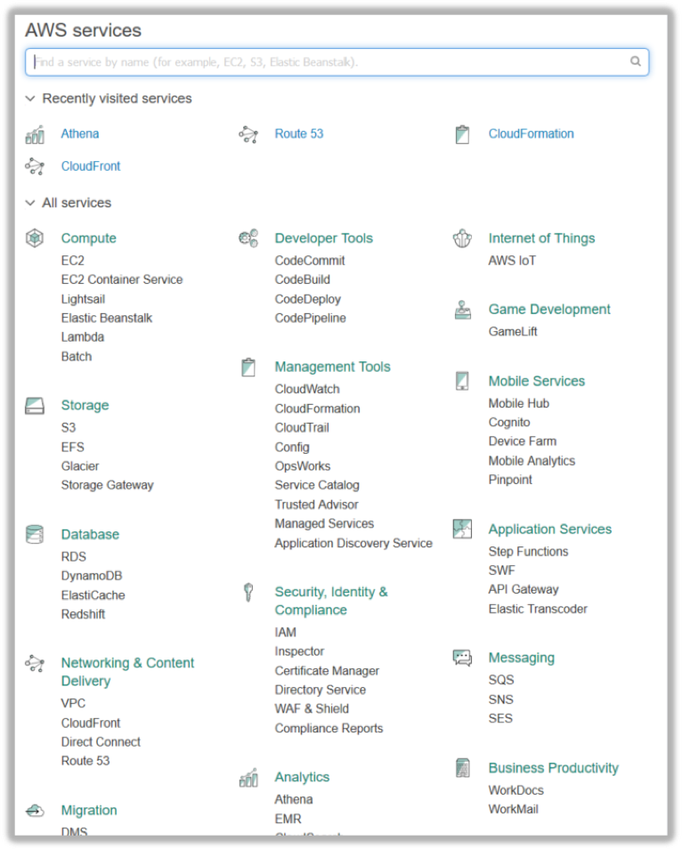

To create a group, select “Groups” then click the “Create a New Group” button. 

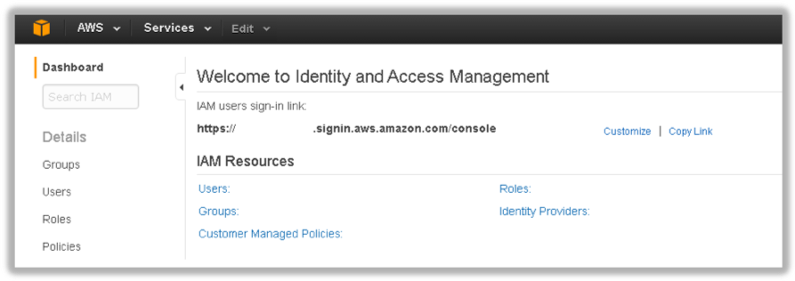

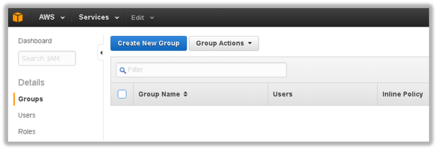

Type Power_Users into the Group Name: text box and click Next Step. 

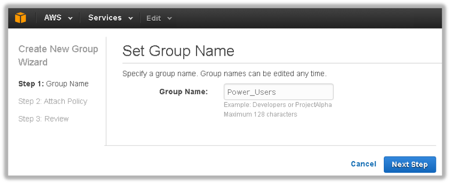

Type Power in the filtering text box then select PowerUserAccess. Click Next Step.

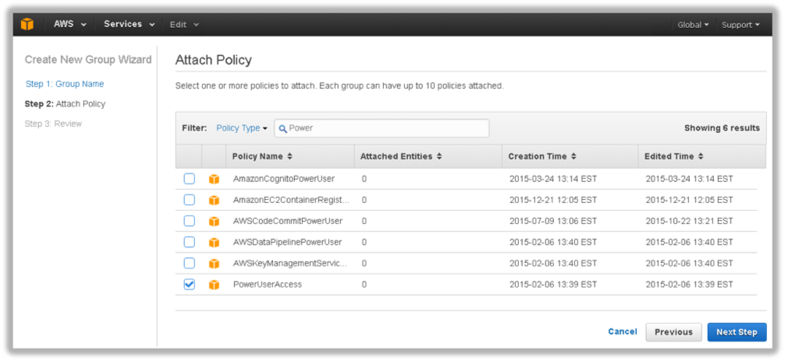

This associate the “Power User” IAM policy to your new group and will allow group members to perform any AWS action 
except perform IAM management. Click Create Group:

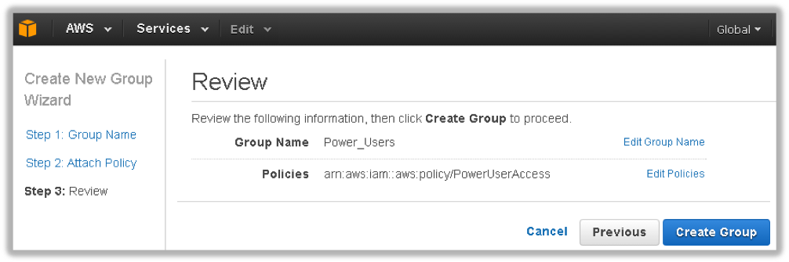
 

To create a user, select “Users” then click the “Add user” button.

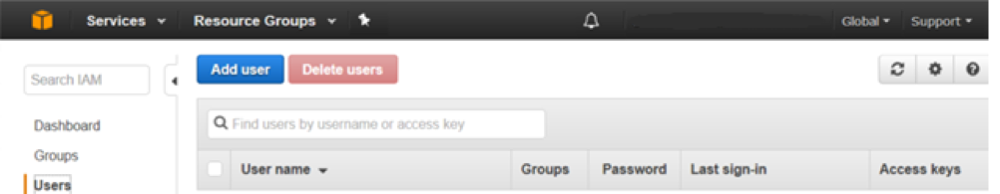
 

Enter ExampleUser in the first text box next to User Name: Select the check box next to Programmatic access and click 
Next: Permissions.

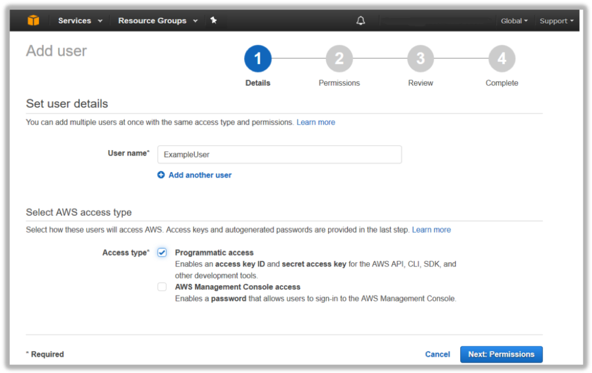

To add the user to the group, select Add user to group then click checkboxk next to Power_Users group and then select 
Next: Review.
 

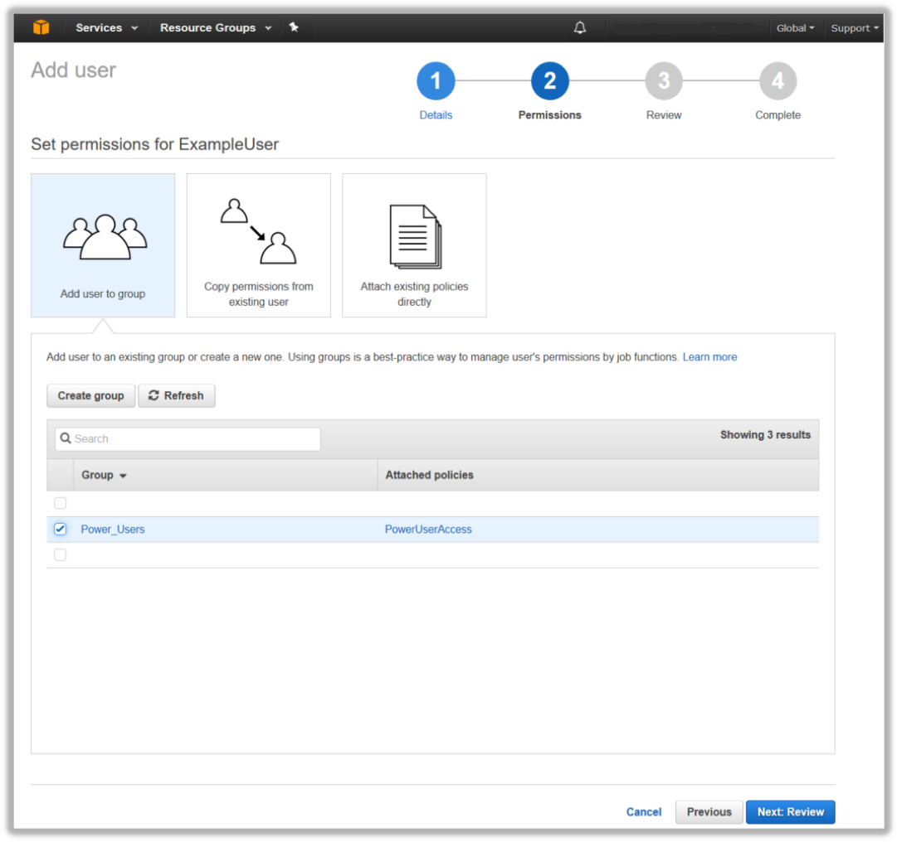

Select Create user. 

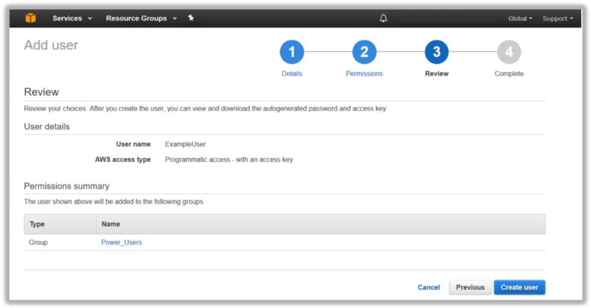

 
Select Close. Your new user and group have now been created, and your user is a member of your group.

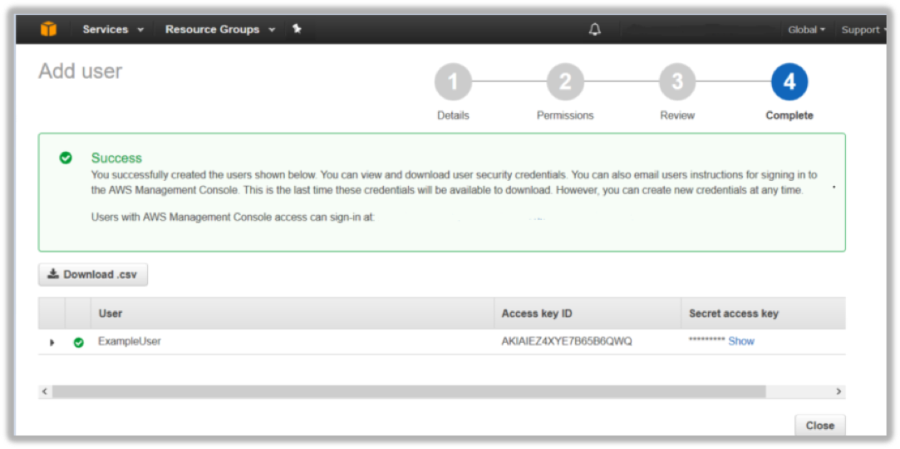

## Managing IAM User Permissions and Credentials

Now that you have created your first IAM user and group, lets take a look at the IAM user properties. Click on the Users 
option in the left-hand menu, then select the ExampleUser account that you just created. 

Notice the user is a member of the Power_Users group that you added them to.

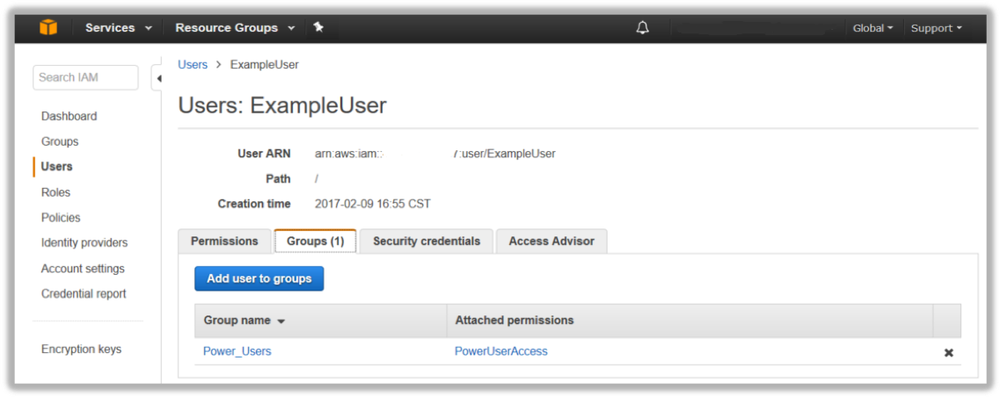

Now select the Permissions tab to see the individual User and Group Policies that will be applied to this account. Note 
that this user only has the PowerUserAccess group policy applied to the account. 
 

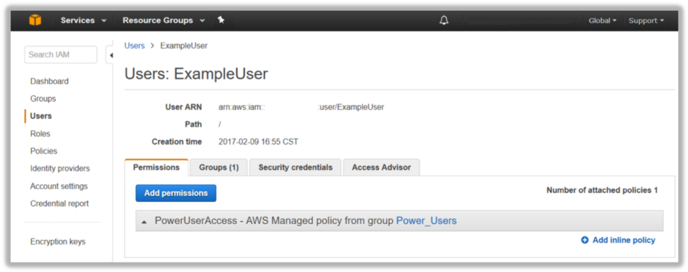

Now select Security Credentials. This is where you can assign or change a User’s Console Password and Multi-Factor 
Authentication device.

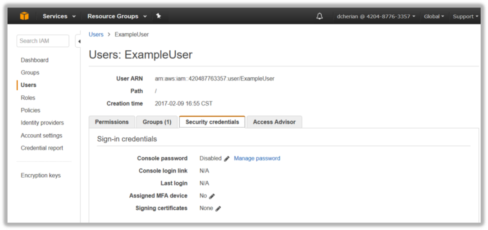
 

From here you can also Create, Rotate, or Revoke a user’s API Access Keys (for using the AWS Command Line tools or other 
direct access to the AWS APIs through custom or 3rd party applications).

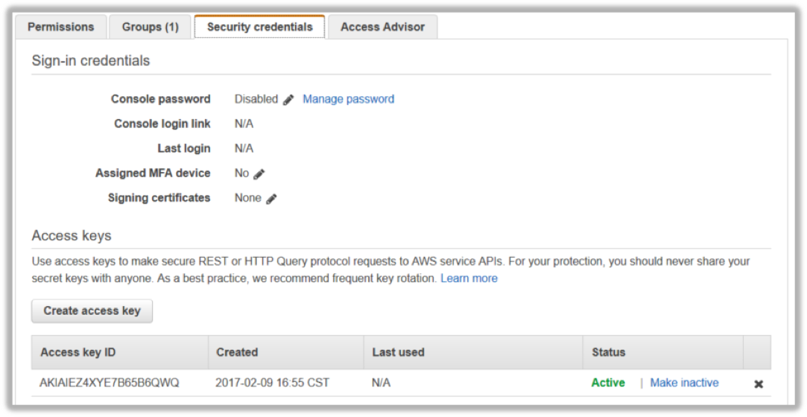

## IAM Roles for EC2
Applications or Command Line Tools running on Amazon Elastic Compute Cloud (Amazon EC2) instances that make requests to 
Amazon Web Services (AWS) must sign all AWS API requests with AWS access keys. AWS Identity and Access Management (IAM) 
Roles for EC2 instances, is a feature that makes it easier for your applications and command line tools to securely 
access AWS service APIs from EC2 instances. An IAM role with a set of permissions can be created and attached to an EC2 
instance on launch. AWS access keys with the specified permissions will then be automatically made available on EC2 
instances that have been launched with an IAM role. IAM roles for EC2 instances manages the muck of securely 
distributing and rotating your AWS access keys out to your EC2 instances so that you don’t have to.

Using IAM roles for instances, you can securely distribute AWS access keys to instances and define permissions that 
applications on those instances use when accessing other services in AWS. Here are some things you should know about 
using IAM roles for instances:

* AWS access keys for signing requests to other services in AWS are automatically made available on running instances.
* AWS access keys on an instance are rotated automatically multiple times a day. New access keys will be made available 
  at least five minutes prior to the expiration of the old access keys.
* You can assign granular service permissions for applications running on an instance that make requests to other 
  services in AWS.
* You can include an IAM role when you launch On-Demand, Spot, or Reserved Instances.
* IAM roles can be used with all Windows and Linux AMIs. 

To create an IAM Role for EC2, click on the Roles link on the left-hand menu and click Create New Role:

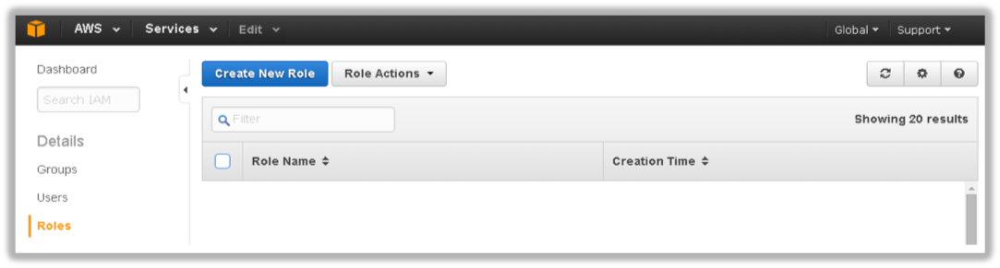

 
Create a new role called SecureAccessS3 and click Next Step: 
 

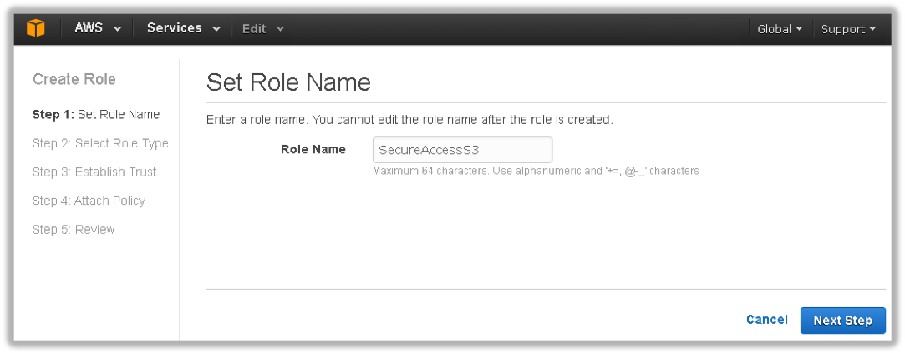

IAM supports several different types of Roles – select the Amazon EC2 Service Role for this example, but IAM roles can 
be used to grant access to AWS Services, other AWS Accounts, and 3rd Party Identity Providers.

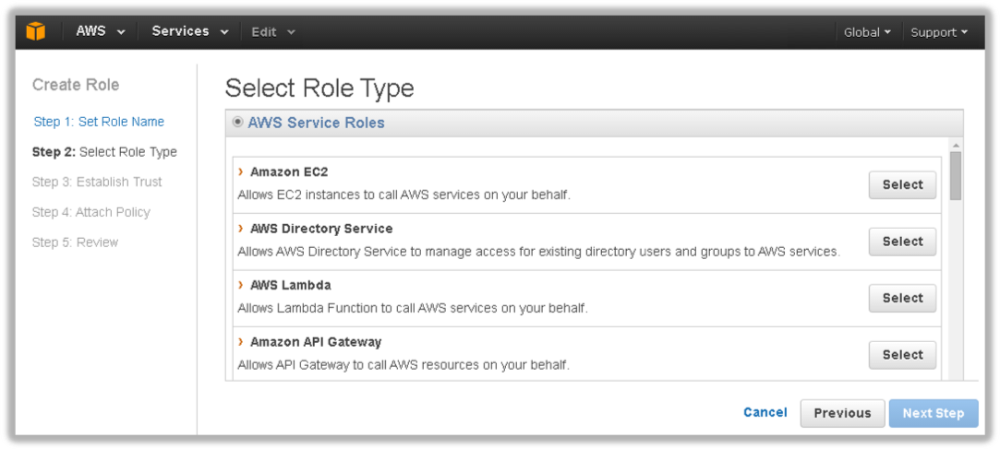

 
We now need to set permissions for this new role. Type s3 then select AmazonS3ReadOnly and click Next Step.
 

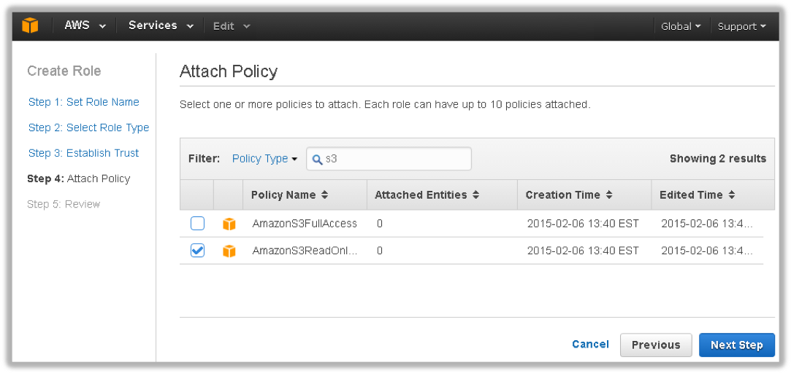

You now have the opportunity to review the role information. Click Create Role.

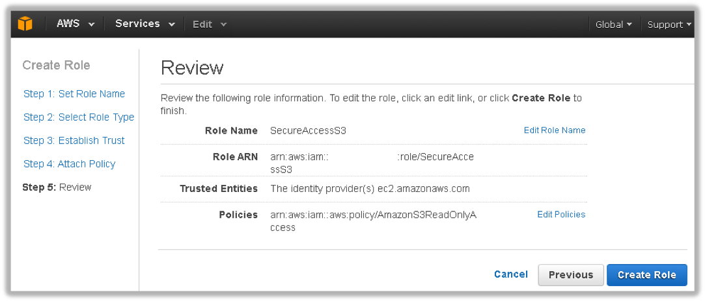

You can now use the newly created IAM Role when you launch an EC2 instance. For example, in the EC2 Console, you can 
select the role as part of launch process. Once the instance is launched, applications and tools that access AWS 
services will automatically pick up temporary credentials made available to the instance by the infrastructure. 

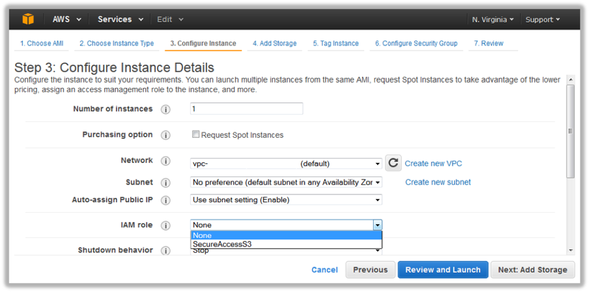

 
Congratulations! You have created your first IAM user, group, and role!

To learn more about IAM Roles for EC2 instances, please visit [Working with Roles](http://docs.amazonwebservices.com/IAM/latest/UserGuide/WorkingWithRoles.html) 
in the Using IAM guide and [Using IAM roles with Amazon EC2 Instances](http://docs.amazonwebservices.com/AWSEC2/latest/UserGuide/UsingIAM.html#UsingIAMrolesWithAmazonEC2Instances) 
in the Amazon EC2 User Guide.

