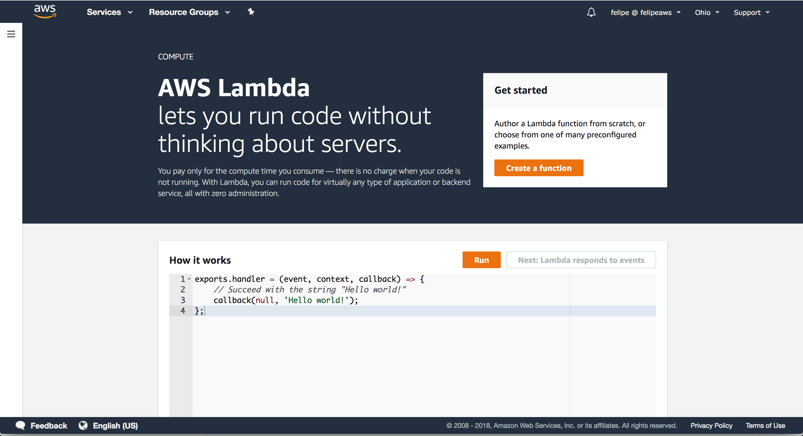
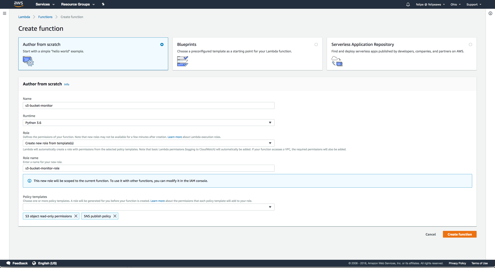
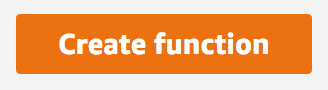
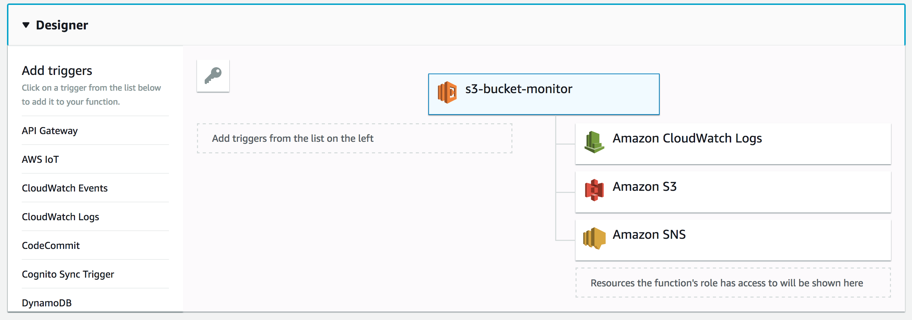
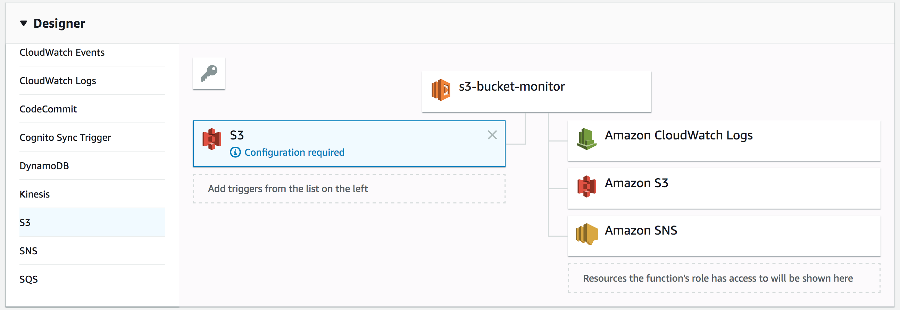
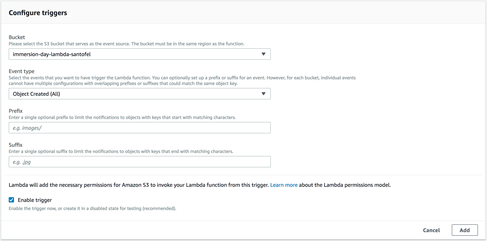
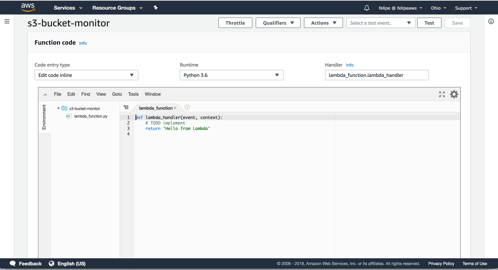
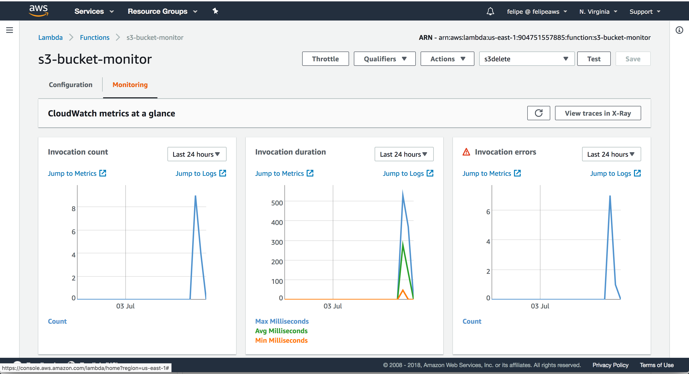

# AWS Lambda

<p align="center"></p>

AWS Lambda lets you run code without provisioning or managing servers. You pay only for the compute time you consume - 
there is no charge when your code is not running.

With Lambda, you can run code for virtually any type of application or backend service - all with zero administration. 
Just upload your code and Lambda takes care of everything required to run and scale your code with high availability. You can set up your code to automatically trigger from other AWS services or call it directly from any web or mobile app.


**NO SERVERS TO MANAGE**

AWS Lambda automatically runs your code without requiring you to provision or manage servers. Just write the code and 
upload it to Lambda.

**CONTINUOUS SCALING**

AWS Lambda automatically scales your application by running code in response to each trigger. Your code runs in parallel 
and processes each trigger individually, scaling precisely with the size of the workload.

**SUBSECOND METERING**

With AWS Lambda, you are charged for every 100ms your code executes and the number of times your code is triggered. You 
don't pay anything when your code isn't running.


* [Create a function](#create-a-function)
* [Test a function](#test-a-function)
* [Monitoring a function](#monitoring-a-function)

## Setup

Create a S3 bucket via Amazon S3 Console or using AWS CLI:

```
aws s3 mb s3://immersion-day-lambda-<your-name> 
```

## Create a function

1. Sign into the AWS Management Console and open the AWS Lambda console at <https://console.aws.amazon.com/lambda>.

1. Click on **Create a function** to create a new function

<p align="center"></p>

1. Select the option **Author from scratch** and give a name to your function:

    **Name:** s3-bucket-monitor
    
    **Runtime:** Python3.6
    
    **Role:** Create a new role from template
    
    **Role name:** s3-bucket-monitor-role
    
    **Policy templates:** "S3 object read-only permissions", "SNS publish policy"
 
    <p align="center"></p>

    Click on {:width="148px" height="30px"} button.
    
1. After the function has been created, click on **Designer** section to check how the function was created.

    <p align="center"></p>
    
1. You'll see that the function has no trigger yet. So scroll down the trigger list (left side) and choose the S3 option.
    
    <p align="center"></p>
    
    Choose the S3 bucket you create at the [Setup](#setup) step. Check if the **Enable trigger** is checked and click 
    **Add**
    
    <p align="center"></p>
    
    After that you need to click **Save** to changes make effect.
    
    <p align="center"></p>

1. Now copy and paste the following code at **Function code**

    <p align="center"></p>

    ```python
    import boto3
    import json
    import logging
    import os
    
    # logging configuration
    logging.basicConfig()
    logger = logging.getLogger(__name__)
    logger.setLevel(os.environ.get('LOG_LEVEL', 'INFO'))
    
    # environment variables
    number = os.environ['NUMBER']
    
    # aws resources
    s3 = boto3.resource('s3')
    sns = boto3.client('sns')
    
    def lambda_handler(event, context):
        logger.info('Loading Lambda Function {}:{}'.format(context.function_name, context.function_version))
    
        logger.info('Processing event: {}'.format(json.dumps(event, indent=4, sort_keys=True)))
        
        put_message = ''
        get_message = ''
        delete_message = ''
        
        for rec in event['Records']:
            event_name = rec['eventName']
            bucket = rec['s3']['bucket']['name']
            object = rec['s3']['object']['key']
            if 'Put' in event_name:
                put_message+='\n{}/{}'.format(bucket, object)
            
            if 'Get' in event_name:
                get_message+='\n{}/{}'.format(bucket, object)
                
            if 'Delete' in event_name:
                delete_message+='\n{}/{}'.format(bucket, object)
            
        if put_message is not '': 
            sns.publish(PhoneNumber = number, Message='Put events:'+ put_message)
    
        if get_message is not '':
            sns.publish(PhoneNumber = number, Message='Get events:'+get_message)
            
        if delete_message is not '':
            sns.publish(PhoneNumber = number, Message='Delete events:'+delete_message)
        
        return None
 
    ```

## Test a function

Upload, download and remove an object from the S3 bucket you created at [Setup](#setup) step.

## Monitoring a function

To monitor a function you can do it by clicking on **Monitor** tab.

<p align="center"></p>