# Amazon Simple Storage Service (Amazon S3)

Amazon Simple Storage Service (S3) provides a simple web services interface that can be used to store and retrieve any 
amount of data, at any time, from anywhere on the web. This lab is designed to demonstrate how to interact with S3 to 
store, view, move and delete objects. This lab will walk you through the following:

* [Creating a bucket in S3](#create-a-bucket-in-s3)
* [Adding a object to the S3 bucket](#adding-a-object-to-the-s3-bucket)
* [View the object in S3](#view-the-object-in-s3)
* [Move the object in S3](#move-the-object-in-s3)
* [Enable bucket versioning](#enable-bucket-versioning)
* [Delete the object and the bucket in S3](#delete-the-object-and-the-bucket-in-s3)

## Create a Bucket in S3

Every object in Amazon S3 is stored in a bucket. Before you can store data in Amazon S3 you must create a bucket.

> NOTE: You are not charged for creating a bucket; you are only charged for storing objects in the bucket and for 
transferring objects in and out of the bucket. 

1. Sign into the AWS Management Console and open the Amazon S3 console at https://console.aws.amazon.com/s3.
1. Click Create Bucket. The Create a Bucket dialog box appears.
    
    
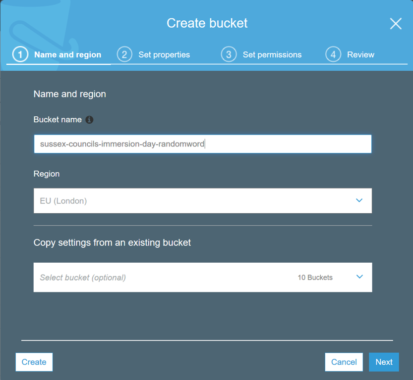

    
1. Enter a bucket name in the Bucket Name field. The bucket name you choose must be unique across all existing 
bucket names in Amazon S1. One way to do that is to prefix your bucket names with your organisation's name. 


    Bucket names must comply with the following requirements.
     
    Bucket names: 
    * Can contain lowercase letters, numbers, periods (.) and dashes (-)
    * Must start with a number or letter
    * Must be between 3 and 255 characters long
    * Must not be formatted as an IP address (e.g., 261.251.1.4) 
    
    > NOTE: There might be additional restrictions on bucket names based on the region your bucket is in or how you 
    intend to access the object. Once you create a bucket, you cannot change its name. In addition, the bucket name is 
    visible in the URL that points to the objects stored in the bucket. Make sure the bucket name you choose is 
    appropriate.
    
1. In the Region drop-down list box, select a region.
1. Click Next. When the Set properties dialogue box appears, click the Tags box, followed by +Add tag.
    
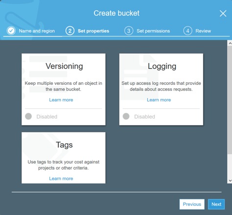

1. In the Key box, type Purpose, and in the Value box, enter Immersion Day. Then click Save, then Next.

    

1. Finally, click Create bucket. When Amazon S3 successfully creates your bucket, the console displays your empty bucket 
in the Buckets panel.

    
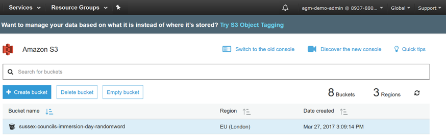

Well done - you've created your first bucket in Amazon S3!

## Adding a object to the S3 bucket

Now that you've created a bucket, you're ready to add an object to it. An object can be any kind of file: a text file, 
a photo, a video and so forth. When you add a file to Amazon S3, you have the option of including metadata with the file 
and setting permissions to control access to the file.

1. In the Amazon S3 console, click the on the name of the bucket to which you want to upload an object (not the bucket 
icon itself, though), and then click Upload in the Objects tab. The Upload dialogue opens (its appearance may differ 
slightly between different browsers):

    
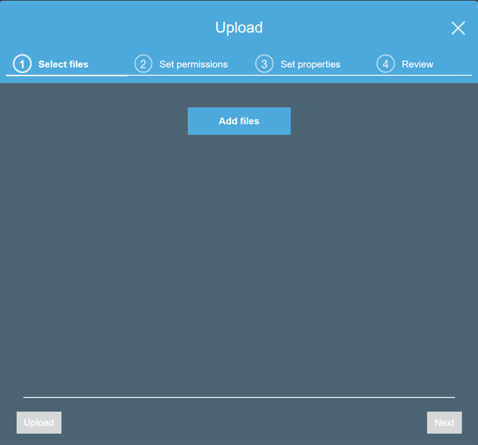

1. Click Add Files to select a file to upload. A file selection dialog box opens. 
1. Select a small file to upload and click Open. The Upload dialogue shows the files and folders you've selected to upload.

    
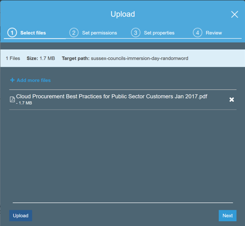
 

1. Click Upload. You can watch the progress of the upload at the bottom of the screen. This appears as soon as the upload 
begins.
Good job - you've added a file to your bucket!

## View the object in S3

Now that you've added an object to a bucket, you can open and view it in a browser.
1. In the Amazon S3 console, click the on the name of the object you want to open. 
    
    
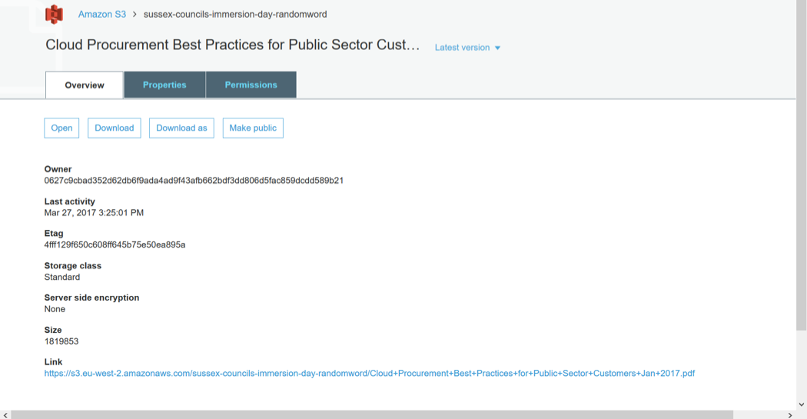

    > NOTE: By default your Amazon S3 buckets and objects are private. To view an object using a URL, for example, 
    https://s3.amazonaws.com/Bucket/Object the object must be publicly readable. Otherwise, you will need to create signed 
    URL that includes a signature with authentication information. You can optionally save the object locally.
 
1. Click on the Permissions tab. In the Manage public permissions section, click the radio button next to Everyone.

    
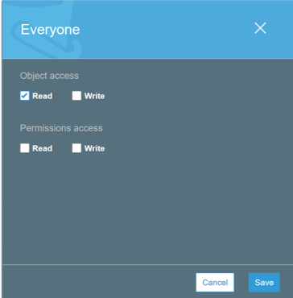

1. In the Everyone dialogue, under the Object access section, tick the Read box, and then click Save. 
1. Click on the Overview tab, and then click on the link to your object at the bottom of the screen to view the file 
using your browser.
Good job - you've opened your object!

## Move the object in S3

Now that you've added an object to a bucket and viewed it, you might like to move the object to a different bucket or 
folder. 
1. In the [Amazon S3 console](https://console.aws.amazon.com/s3), select the object(s) you want to move by clicking the 
selection box to their left.

    
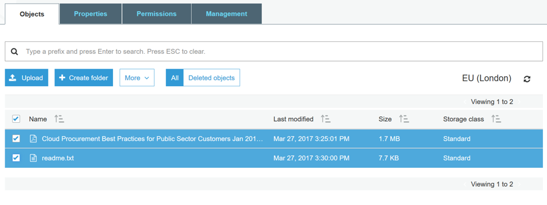

     
1. Click on the More button, and then click Cut.
1. Navigate to the target bucket (and folder, if applicable) to which you want to move the object, click the More button 
and then click Paste. At the Cut and paste review dialogue, confirm the action by clicking Paste.
    
    
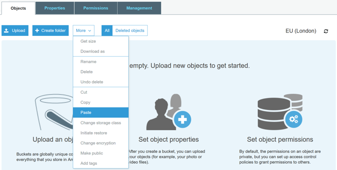

    > NOTE: When you move an object across buckets the previously set object permissions will persist by default.

## Enable bucket versioning

If you want to add new version of the object to the same bucket but want to retain the old version, you can turn on 
bucket versioning.
1. In the S3 Console, click on the link representing the bucket you created, and then select the Properties tab.

    
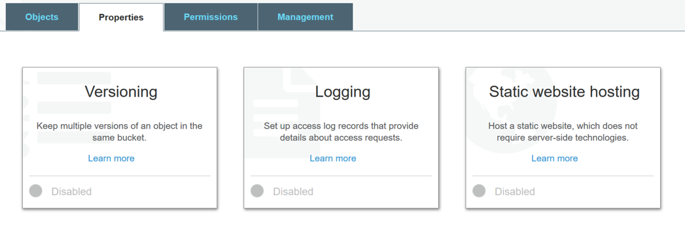

    
1. Click on the Versioning tile, select the Enable versioning radio button, and then click Save.

    
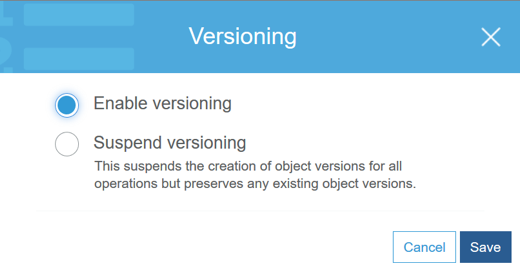

    
1. Choose an object that you are able to edit on your computer, and upload it using the steps from the Add an Object to 
a Bucket section above.
1. Now open the original file on your computer and edit it, saving the updated version under the same file name.
1. Upload this updated file to the S3 bucket in the same way as before.
1. Now click on the object’s link in the S3 bucket and click on the the words Latest version (to the right of the 
object’s name).

    
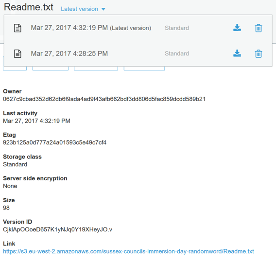

    
This shows the different versions of the object in the bucket.

## Delete the object and the bucket in S3

You’ve added an object to a bucket, viewed it, and moved it. Now, you can delete it and the bucket it's in.
If you no longer need to store the objects you uploaded and moved while going through this guide, you should delete them 
so you do not incur further charges on those objects.
1. In the [Amazon S3 console](https://console.aws.amazon.com/s3), click on the link representing the bucket containing 
the object(s) you want to delete. Then select the object(s).
1. Click the More button, followed by Delete. To confirm the action in the Delete objects dialogue, click Delete.
1. Navigate back to the S3 console and select the bucket icon of the bucket you want to delete (not the link to its 
right), and click Delete bucket. Confirm the deletion by typing its name verbatim at the Delete bucket prompt.

    > NOTE: To delete a bucket, you must first delete all of the objects in it. If you haven't deleted all of the objects 
    in your bucket, do that now.

Well done, your bucket is now deleted!

## Conclusion
In this lab you have learned the basic operations to manage the lifecycle of an S3 object. First, you created a bucket, 
which is the logical container of objects. Then by uploading, viewing, moving an object, and enabling versioning, you 
learned the basic operations of the object itself. Finally, you learn how to delete both an object and a bucket.
