# Amazon Virtual Private Cloud (Amazon VPC)

This lab will walk the user through using the VPC wizard to create a VPC with public and private subnets, describe each 
of the objects created by the wizard, and launch instances into the public and private VPC subnets. The lab will also 
review recently released VPC features -- VPC flow logs and VPC endpoints.

* [Create a VPC](#create-a-vpc)
* [VPC Object Walkthrough](#vpc-object-walkthrough)
* [Your VPCs](#your-vpcs)
* [Internet Gateways](#internet-gateways)
* [DHCP Options Sets](#dhcp-options-sets)
* [Elastic IPs](#elastic-ips)
* [NAT Gateway](#nat-gateway)
* [Peering Connections](#peering-connections)
* [Network ACLs](#network-acls)
* [Security Groups](#security-groups)
* [Launching VPC Instances](#launching-vpc-instances)
* [Launch a Private Server](#launch-a-private-server)
* [Launch a Public Server](#launch-a-public-server)
* [Terminate Billable Services](#terminate-billable-services)
* [Advanced VPC Concepts](#advanced-vpc-concepts)
    * [VPC Flow Logs](#vpc-flow-logs)
    * [Creating Flow Logs for a Subnet](#creating-flow-logs-for-a-subnet)
    * [Creating Flow Logs for a VPC](#creating-flow-logs-for-a-vpc)
    * [Creating Flow Logs for a Network Interface](#creating-flow-logs-for-a-network-interface)
    * [VPC Endpoints](#vpc-endpoints)

> NOTE: Screenshots are provided to guide you through the steps in the lab. The elements that you will create (e.g. VPC, 
NAT Gateway, EIP) will be unique to your account, so things such as VPC ID that you see in the console will not 
necessarily mirror what's seen in the screenshot.

## Create a VPC

Log into the **AWS Console**, and click on **VPC** to go to the VPC dashboard. Along the left, click on **Elastic IPs**, 
and click the **Allocate New Address** button. We are reserving an IP address to be used later in the VPC Wizard for the 
NAT Gateway.

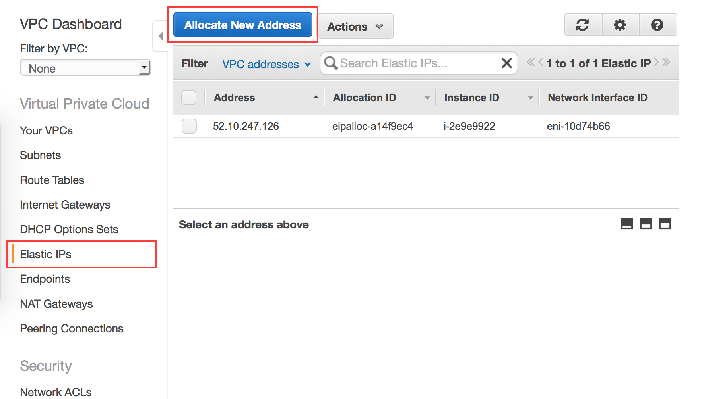

Click on **Yes, Allocate**.

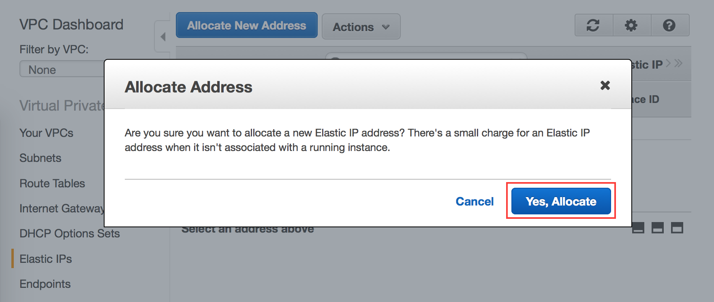

You will see the new EIP allocated to your account. Note down the Allocation ID, which we will reference later during 
the VPC wizard and lab cleanup.

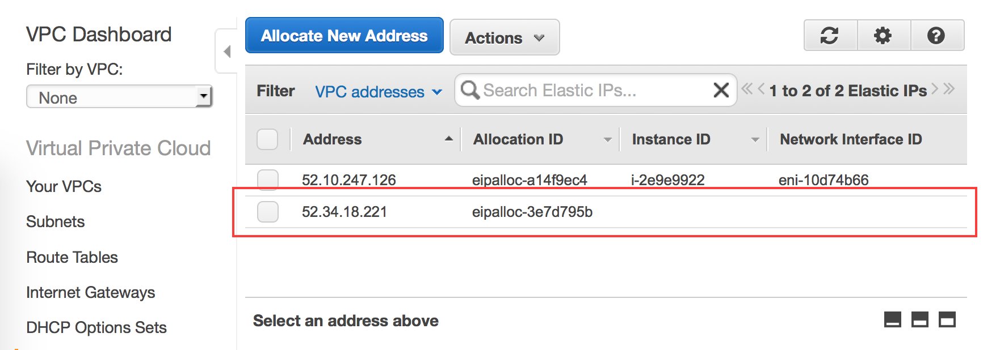

Click on **VPC Dashboard**, then select the **Start VPC Wizard** button to launch the VPC creation wizard.

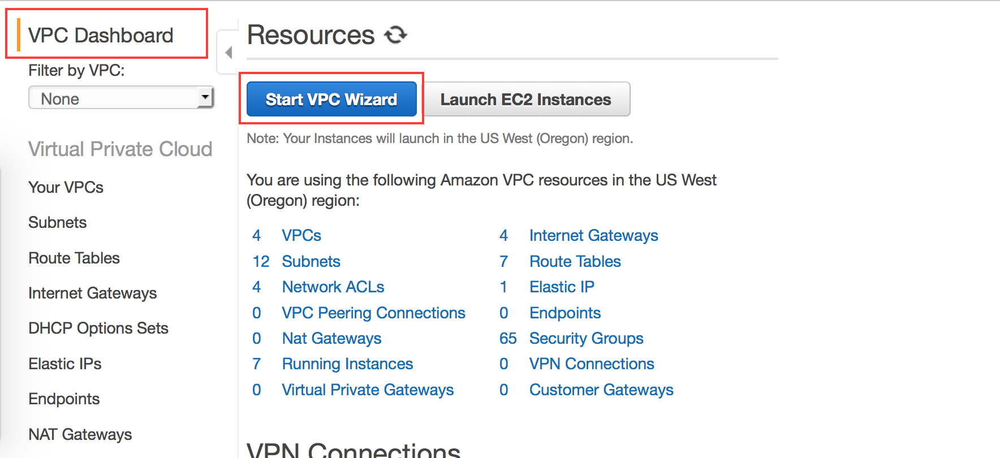

Select the second option to create a **VPC with Public and Private Subnets** and click **Select**. Note in the 
picture that the wizard will automatically create and launch an NAT gateway to enable instances in the private subnet 
to connect to the Internet. We will discuss the NAT gateway in more detail later in this lab.

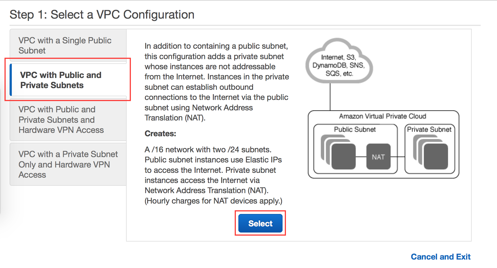

On the next page, enter the following values into the **VPC name**, **Public Subnet,** and **Private Subnet** text 
fields:

VPC name: *\<Your Name\>*

Public Subnet: 10.0.0.0**/23**

Private Subnet: 10.0.10.0**/23**

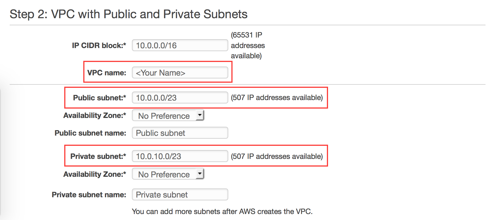

Click on the **Elastic IP Allocation ID** field. A list of available EIPs will appear, select the EIP that you 
allocated at the beginning of the lab.

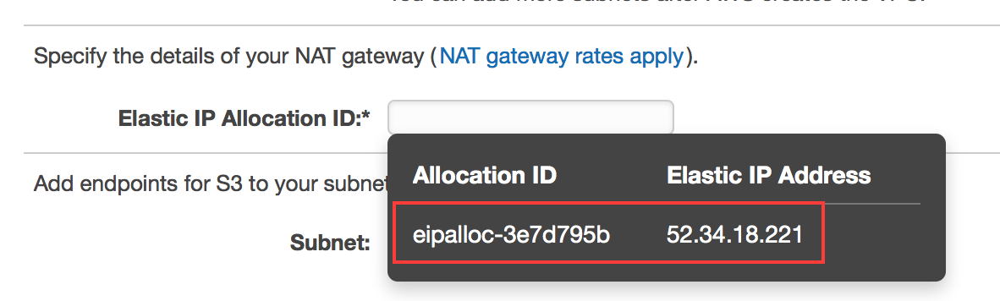

We are modifying the default subnet sizes to illustrate how you can carve up the subnets to your requirements, as well 
as providing some room between the "public" and "private" subnet blocks to accommodate expansion to include additional 
Availability Zones in the future as well.

The VPC wizard will create your subnet and let you know when it has been successfully created. Behind the scenes, the 
wizard is creating and launching the NAT gateway. Click OK when it's done

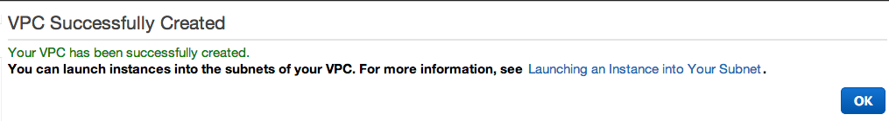

## VPC Object Walkthrough

After your VPC was created, you may notice that several things have been created for you as depicted in the screenshot 
below. The next set of steps will walk you through the various VPC objects and components that were created for you by 
the VPC Wizard.

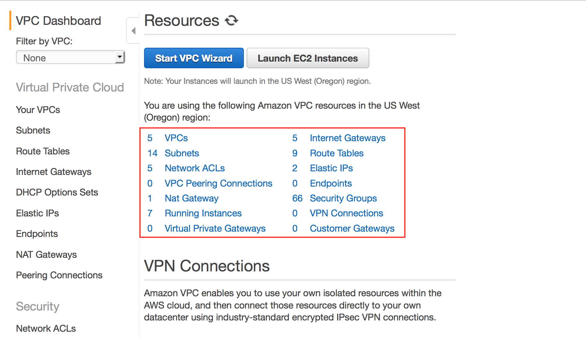

### Your VPCs

The **Your VPCs** link provides a list of your VPCs and is a good location to obtain the VPC ID for your VPCs. If you 
create multiple VPCs, they will be listed here. Clicking on the VPC that was just created will bring up details about 
the VPC like the IP address block (CIDR), DHCP Options Set, Route Table, Network ACL, Hardware Tenancy (whether VPC 
physical hardware will be shared \[default\] or dedicated to you) and DNS configuration information.

Also note the presence of a Default VPC listed in the **Your VPCs** display. As of December 4^th^, 2013, we create a 
default VPC for you in each region. The default VPC includes a subnet per availability zone, a default security group, 
an Internet gateway, and other networking elements. For the purposes of this lab, we will ignore the Default VPC and 
focus on the VPC's created as part of the lab exercise.

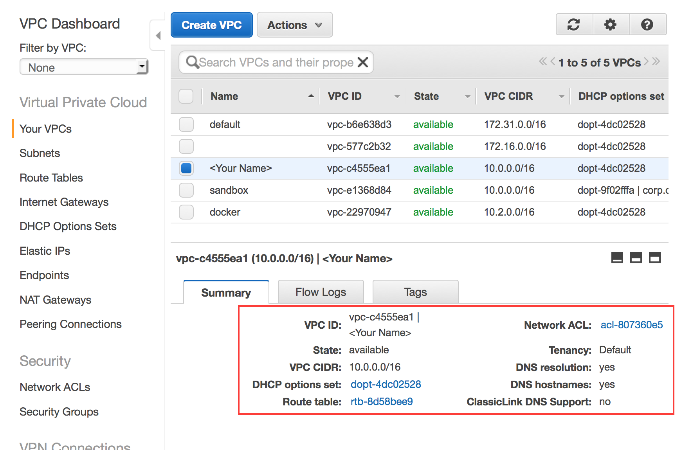

### Subnets

The **Subnets** link lists all of your VPC subnets and allows you to create additional subnets within your VPC with the 
**Create Subnets** button. Clicking on a subnet will bring up subnet details including its subnet address range (CIDR), 
availability zone, and associated route table and network ACLs. Clicking on tabs underneath brings up relevent info about 
the subnet. Click on the Public Subnet created by the VPC Wizard.

Click on Route Table tab and notice that this subnet's default route (0.0.0.0) is the Internet Gateway (described below 
in the Internet Gateway section). Internet Gateways can be identified by "igw" prefix in its ID. This route makes this 
subnet your "public" subnet because it is publically routable through the Internet Gateway.

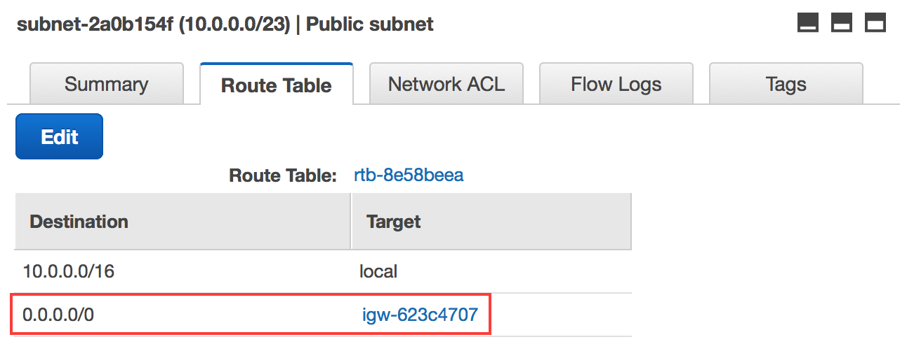

If you click on the Private subnet to inspect its details, you will notice a different routing table.

This subnet's default route (0.0.0.0) is the NAT gateway identified by the "nat-" prefix in its ID. This route makes 
this subnet your "private" subnet because it is not routing through the Internet Gateway. Instead, all client connections 
to the Internet are directed to, and proxied by, your NAT gateway in the "public" subnet.

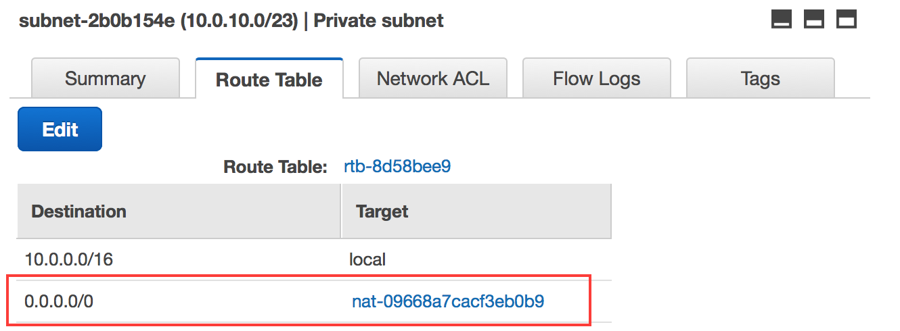

### Route Tables

The **Route Tables** link lists all of your VPC route tables, allows you to modify and associate the route tables to 
subnets, and allows you to create additional route tables within your VPC with the **Create Route Table** button. Notice 
that two route tables were created by the VPC Wizard, and these are the same route tables that were displayed in the 
subnet details in the previous section. Notice the **Main** and **Associated With** columns. The subnet designated as 
the "Main" subnet (Main = Yes) is the default route table for the listed VPC. This means that all subnets that are not 
explicitly associated with a more specific route table will use this route table by default. The Associated With column 
displays number of subnets explicitly associated with the route table.

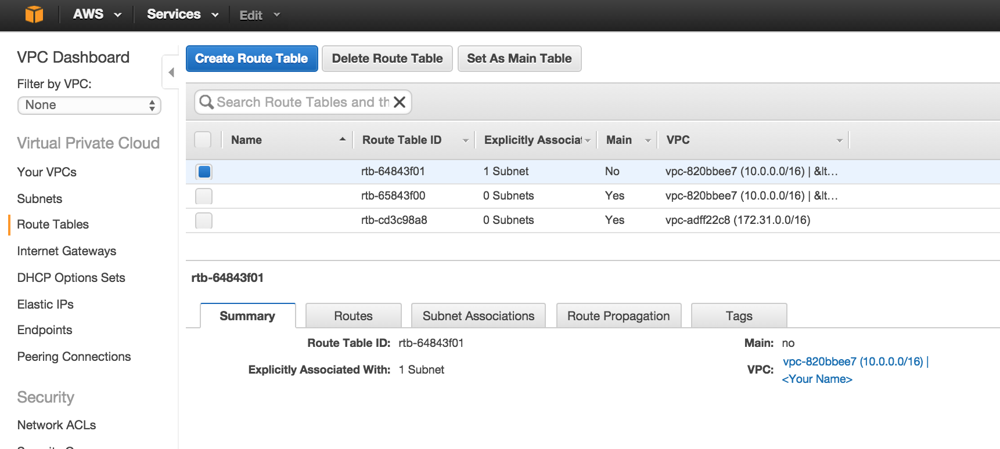

Notice that only 1 of the 2 subnets created with the VPC is associated
with a route table. The second subnet is not explicitly associated with
a route table and is therefore using the "Main" route table.

Clicking on a route table will bring up details about the route. Clicking on Routes tab underneath will bring up routing 
info as well as the ability to modify the route table's routes by clicking on **Edit** button. Similarly you can view or 
modify Subnet Associations, Route Propagation and Tag information pertaining to the selected route.

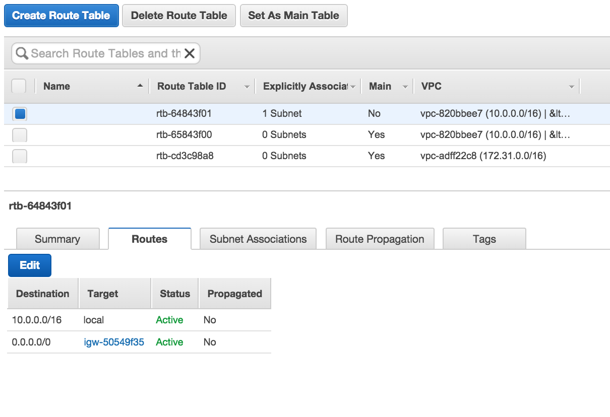

Notice that the selected route table is NOT the Main route table (Main = No) and its default route (0.0.0.0) is the 
Internet Gateway. This means your "public" subnet is explicitly associated with this route table (click on the Subnet 
Associations tab to verify this). Notice there is another route table associated with the VPC, you will see the default
route (0.0.0.0) is your NAT gateway.

So what does all this mean? By default, the VPC Wizard created two subnets and two route tables. The "public" subnet is 
associated with a route table that directs traffic by default out to the Internet. The "private" subnet is not associated 
with a specific route table and therefore inherits the Main route table rules which directs traffic by default to the NAT 
gateway in the "Public" subnet.

One more thing to note: The rules in the Main route table determine how subnets will be treated by default. Since the Main 
route table is a "private" route table (it does not route any traffic to the Internet Gateway), all new subnets created 
in this VPC will be "private" subnets by default. They will remain "private" until they are explicitly associated with a 
"public" route table (e.g. one that routes traffic directly to the Internet Gateway).

## Internet Gateways 

An Internet Gateway provides 1-to-1 static network address translation (NAT) mapping for your VPC instance internal IP 
addresses to publically routable Elastic IP addresses that you must explicitly associate with your "public" VPC instances. 
For the purposes of this lab, the VPC Wizard created an Internet Gateway and associated it with your VPC.

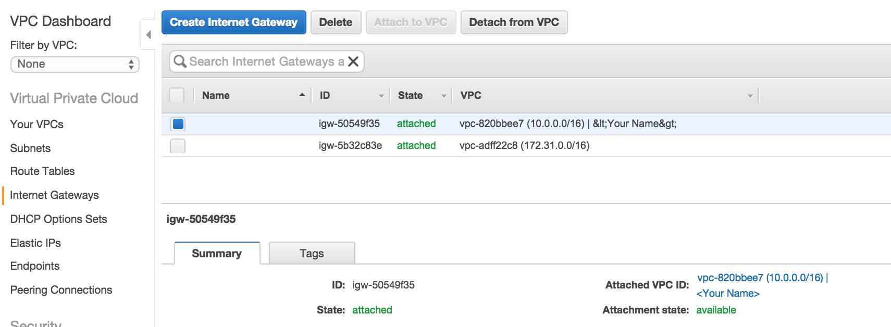

You do not need to do anything specifically with the Internet Gateway in
this lab. We point it out here to explain the Internet Gateway that was
created for you, and to point out that Internet Gateways can be
independently created, attached and detacted to VPCs. This allows you to
add or remove the Internet Gateway capabilities to your VPCs after the
VPC has been created.

## DHCP Options Sets

The **DHCP Options Sets** link allows you to control some DHCP options that the VPC provided DHCP service will present 
to your instances when they boot. By default the VPC Wizard created a DHCP Options set that tells your VPC instances to 
use the AWS provided DNS service for domain name resolution.

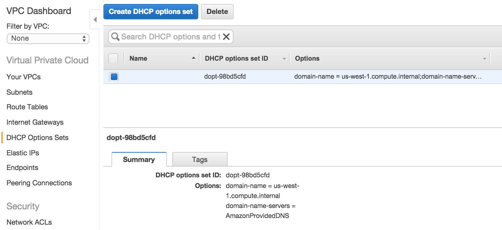

VPC allows you to create and attach new DHCP Options to your VPCs including setting your domain name, domain name (DNS) 
servers, time (NTP) servers, and Microsoft Windows NetBIOS name servers and node type. The following screenshot depicts 
how these options can be configured when creating a new DHCP Options Set.

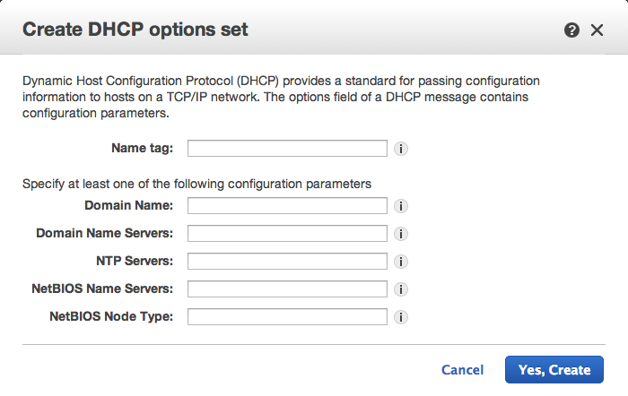

## Elastic IPs

VPC Elastic IPs are static, publically routable IP addresses that you can associate with your VPC Instances. Earlier, 
the VPC Wizard launched a NAT gateway and associated a public Elastic IP address. You can see this EIP and association 
by clicking on the **Elastic IPs** link and selecting the Address.

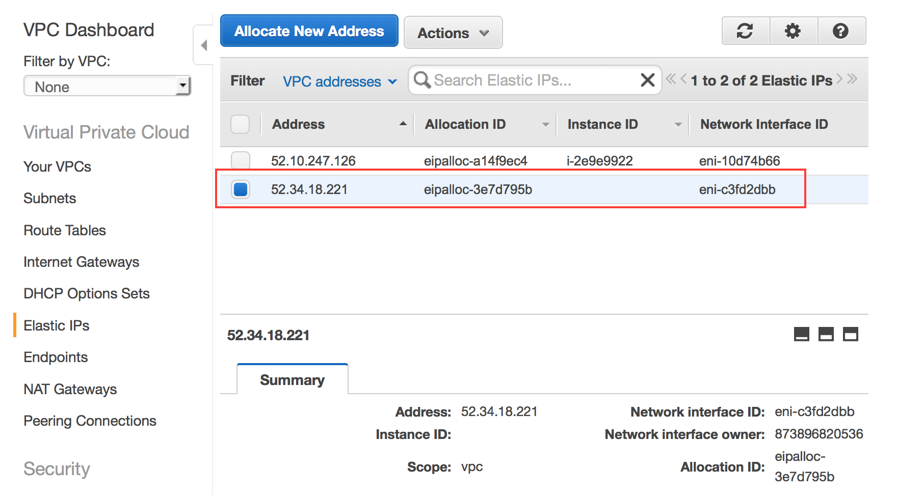

## NAT Gateway

A NAT gateway is a managed service that enables EC2 instances in private subnets to reach the Internet without publicly 
exposing the instance. It uses network address translation to map the private IP address of an EC2 instance to the shared 
public IP address of the NAT gateway and re-maps return traffic back to the instance. NAT gateways have built-in 
redundancy and automatically scales capacity up to 10Gbps based on demand.

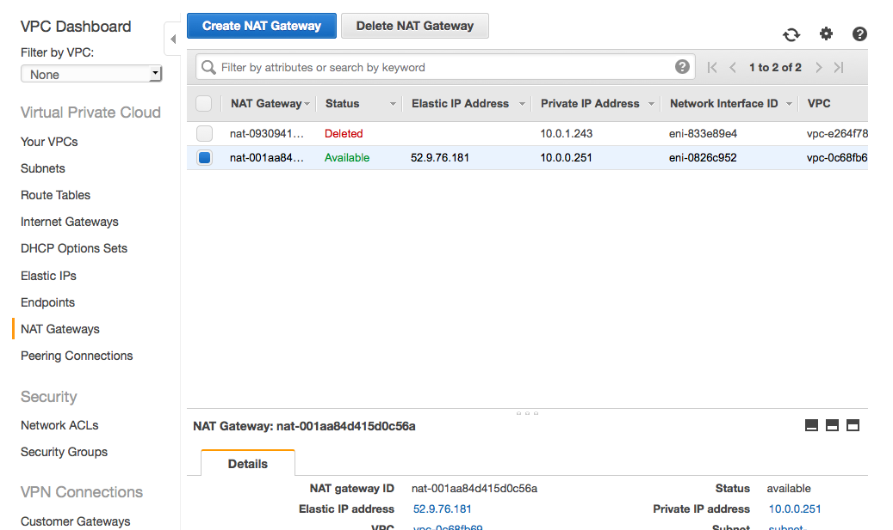

For the purposes of this lab, a NAT gateway was created for you earlier in the VPC Wizard, and you can view details of 
your NAT gateway here.

## Peering Connections 

A VPC peering connection is a networking connection between two VPCs that enables you to route traffic between them using 
private IP addresses. Instances in either VPC can communicate with each other as if they are within the same network. 
You can create a VPC peering connection between your own VPCs, or with a VPC in another AWS account within a single 
region. AWS uses the existing infrastructure of a VPC to create a VPC peering connection; it is neither a gateway nor a 
VPN connection, and does not rely on a separate piece of physical hardware. There is no single point of failure for 
communication or a bandwidth bottleneck. There is no need to create a VPC peering for this lab.

## Network ACLs

Network Access Control Lists (NACLs) act as a subnet *stateless* firewall, controlling ingress and egress for an entire 
subnet (as a second layer of defense on top of security groups). If you click on the **Network ACLs** link you will see 
that the VPC Wizard created a single "default" NACL for your VPC with a default Allow ALL rule. Since NACLs are stateless, 
we recommend using NACLs only when you want to explicitly deny traffic. For example, we never want to use TFTP or "this" 
subnet should never be able to talk to "that" subnet.

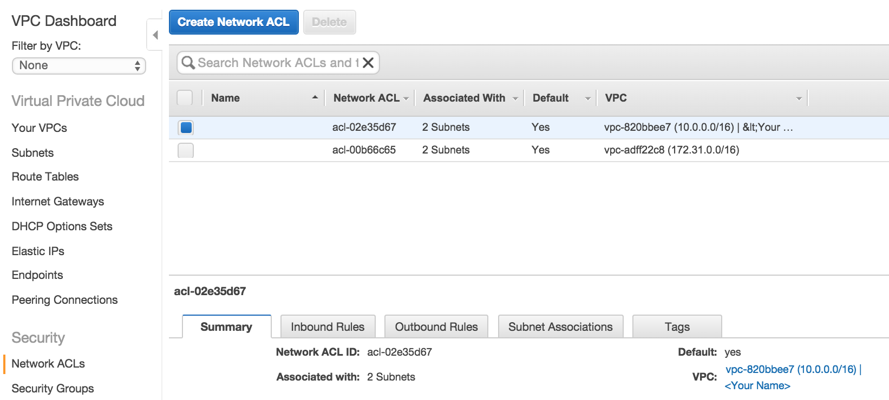

## Security Groups

At this point you should already be familiar with EC2 Security Groups and understand the difference between 
[EC2 and VPC Security Groups](http://docs.amazonwebservices.com/AmazonVPC/latest/UserGuide/VPC_SecurityGroups.html#VPC_Security_Group_Differences).
The **Security Groups** link allows you to see your VPC Security Groups. Notice that the VPC Wizard created Security 
Group for you called "default".

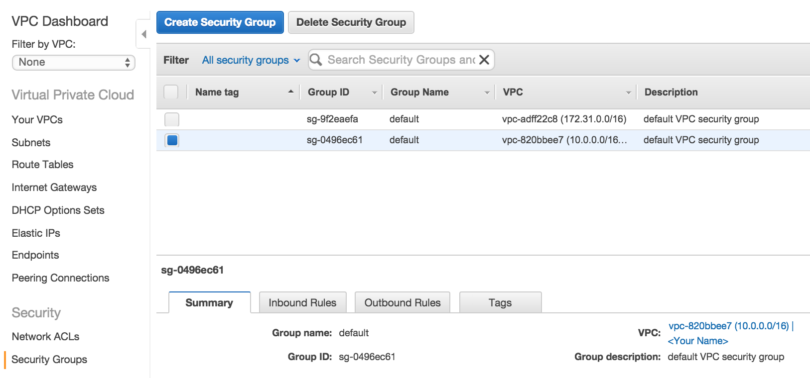

## Launching VPC Instances

Walk through launching an instance in the private subnet. Create a security group and allow ICMP requests from the VPC CIDR. 
Notice how there is no public way to route to the instance (e.g. you can't ping it)?

Now launch an instance in the public subnet. Create a new security group and allow ICMP requests from the world. Note how 
you still can't ping it? Add an EIP. Note how you can now ping the public instance but not the private one. Connect to 
public instance and ping the private one.

## Launch a Private Server

In the AWS Management Console, EC2 tab, click on the **Launch Instance** button.

On **Step 1: Choose an Amazon Machine Image (AMI)** select the latest Amazon Linux AMI.

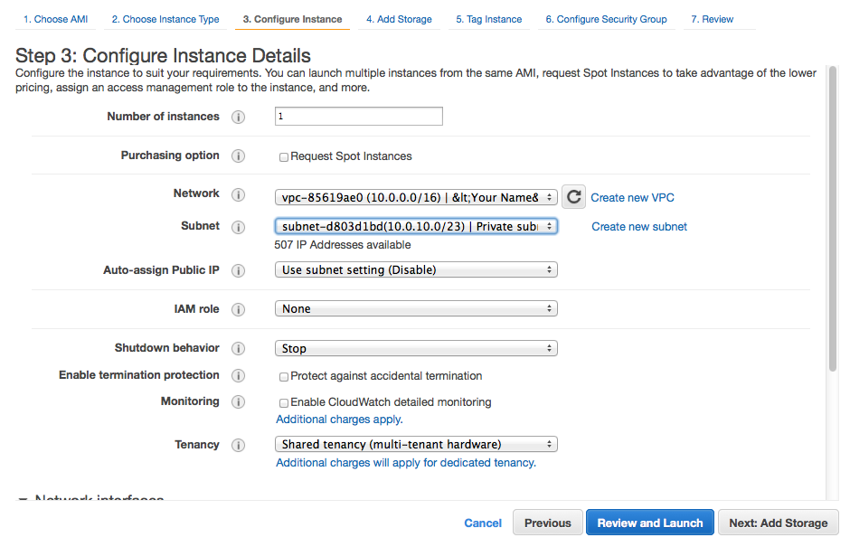

Leave defaults on Step 4. On the next screen, Step 5 (Tag Instance), you can provide a name for your private server 
(e.g. **Private Server**) and click **Next**. 

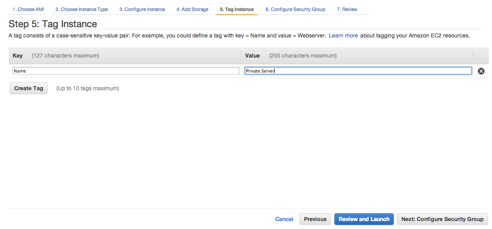

On **Step 6: Configure Security Group**, create a new security group. In this example we call it **Private\_Servers** 
and give permission for all instances in the VPC to "ping" these servers.

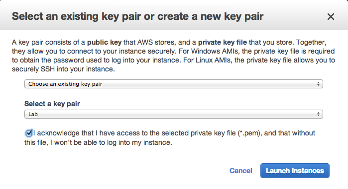

If you missed that lab or are missing the key pair, select **Create a new key pair** from the first drop down, name the 
key pair **Lab**, and click **Download Key Pair**. Once downloaded, click **Launch Instances**.

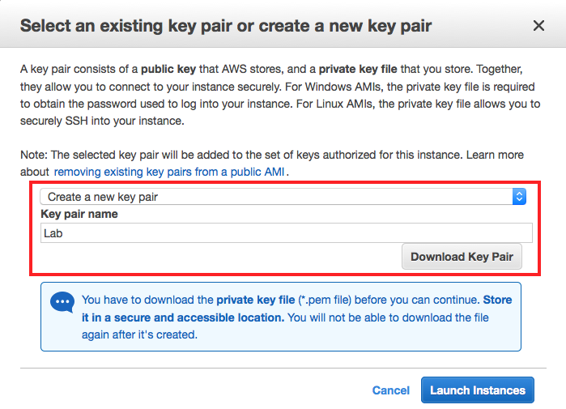

You have now launched a private server in your VPC. Find the new instance in your list of EC2 instances and select it. 
In the instance description, note that the instance has a private IP address (10.0.10.177 in the screenshot below), but 
does not have any associated public information for connecting to this instance (e.g. no EIP or Public DNS information). 
This instance is only locally accessible from within your VPC (theoretically it could also be locally accessible from 
inside a corporate network if we had established a hardware VPN connection to the VPC from our corporate network).

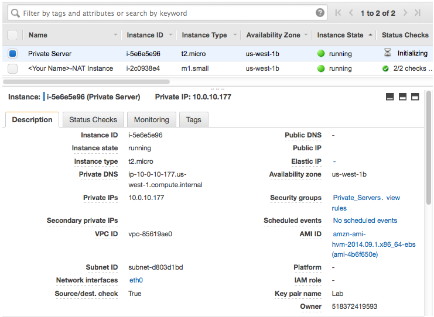

## Launch **a Public Server**

Now that you have a private server, we will launch a public server and differentiate between the two. In the AWS 
Management Console, EC2 tab, click on **Launch Instance** button. On

**Step 1: Choose an Amazon Machine Image (AMI)** select the 64-bit Amazon Linux AMI.

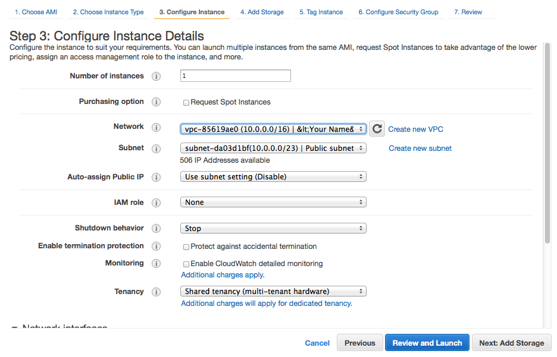

Leave the defaults on **Step 4**, provide a name for your public server (e.g. **Public Server**) and click **Next**.

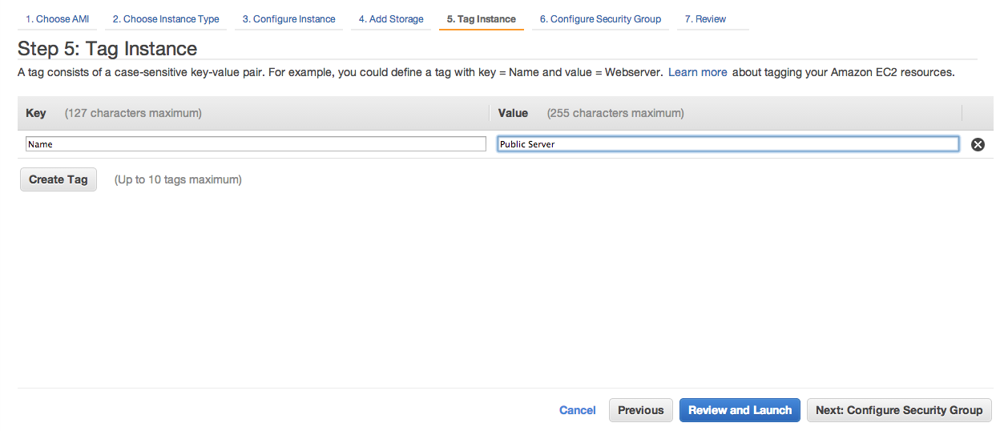

**Step 6:** Create a new security group for your public servers. In this example we create a security group called 
**Public\_Servers**, with rules to allow anyone to "ping" and SSH into the instance.

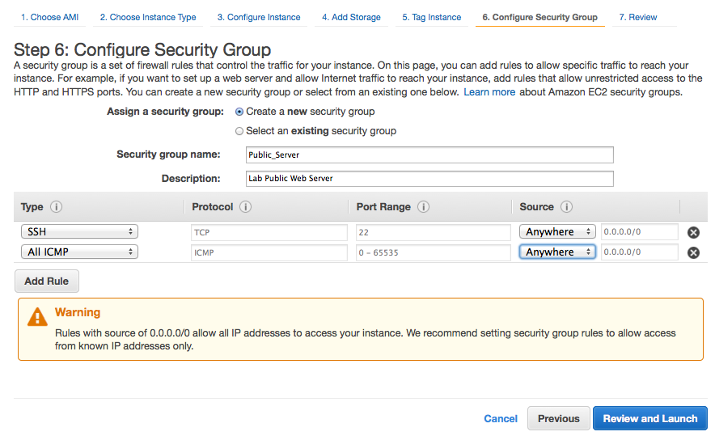

Finally, review your settings, click **Launch** and use your existing key pair, acknowledge that you have access to the 
selected private key file (\*.pem) and click **Launch Instances**.

You have now launched a server in your public subnet; however it is still not publicly accessible. Find the new instance 
in your list of EC2 instances and select it. In the instance description, note that the instance has a private IP address 
(10.0.1.79 in the screenshot below), but does not have any associated public information for connecting to this instance 
(e.g. no EIP or Public DNS information) -- just like your private instance. 

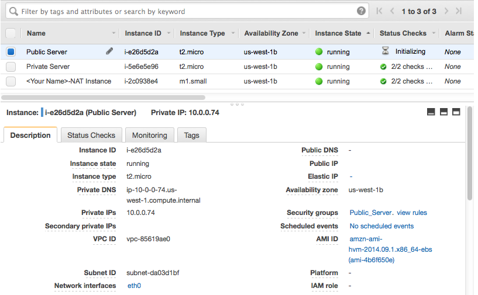

To make this instance publically accessible, we need to assign the server a public Elastic IP address. In the **EC2** 
console, click on the **Elastic IPs** link. Click on the **Allocate New Address** button.

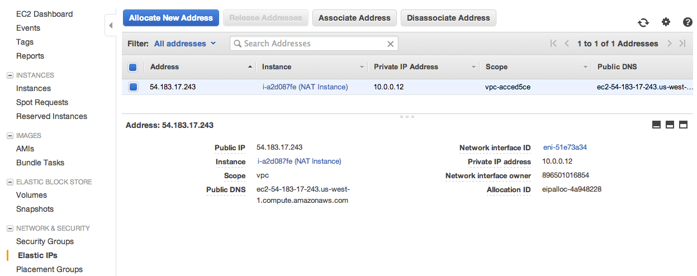

Click **Yes, Allocate**.

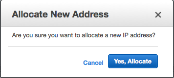

Next right-click on the new EIP that was allocated and select **Associate Address**.

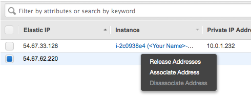

Select your **Public Server** from the Instance dropdown and click **Associate**. 

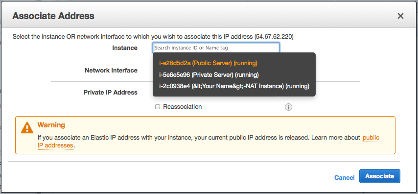

You should now be able to connect to your public server using its new Elastic IP address. In the example screenshot 
below, we demonstrate this connectivity by simply "pinging" the server. 

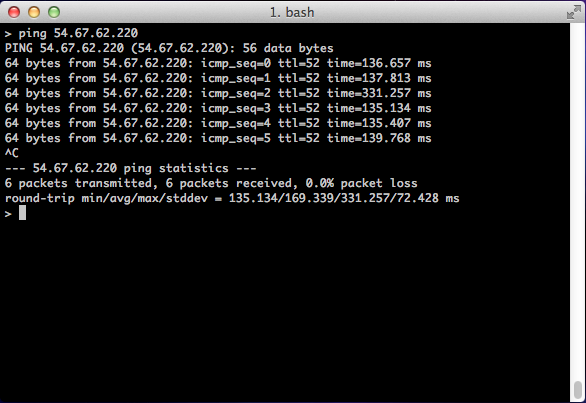

You have now successfully created public and private servers in a VPC. Feel free to explore the instance details for both 
instances to see the EIP assignment to your public server and examine the differences between the two instances.

## Terminate Billable Services

You will not be able to delete your VPC until all instances using the VPC have been terminated. At this point feel free 
to terminate the Public and Private Servers that we created in this lab.

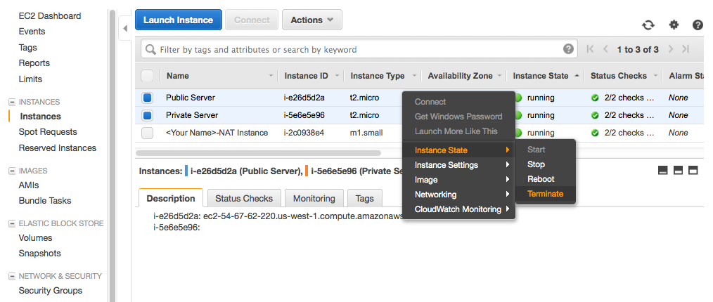

Check the box to Release the EIP along with instance termination so that you don't incur Idle EIP charges and click 
**Yes, Terminate**.

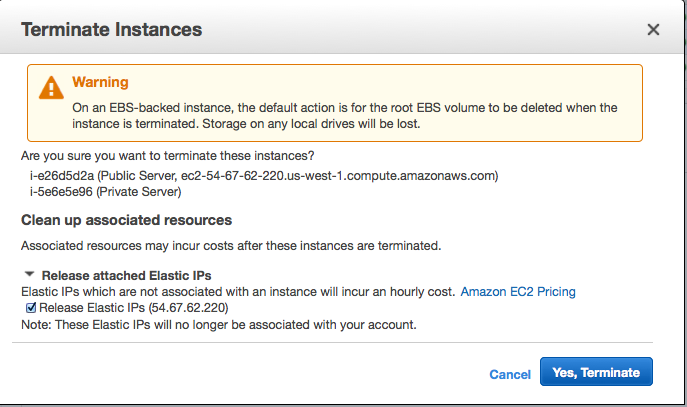

Finally, to completely delete the VPC, first delete the NAT gateway. Click on **NAT Gateways** from the VPC Dashboard, 
select the NAT gateway created earlier in the lab, and click **Delete NAT Gateway**.

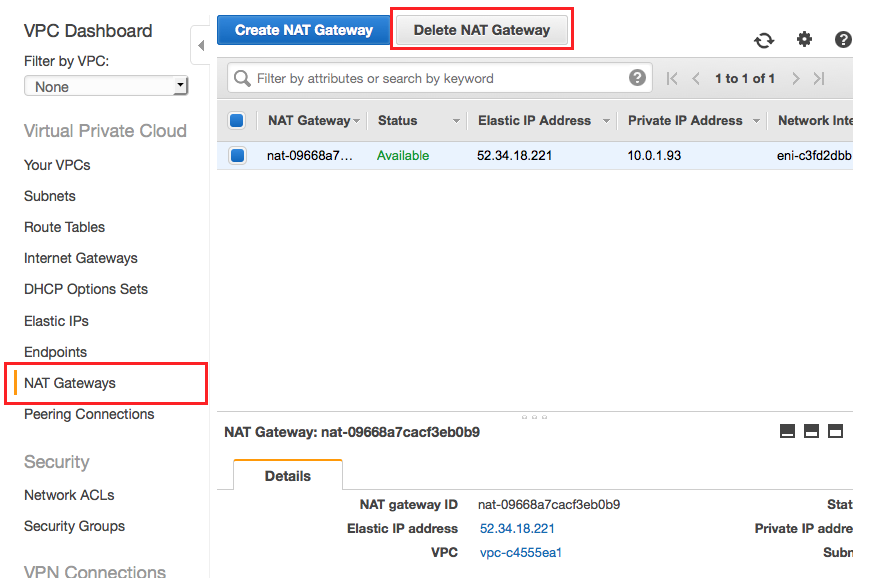

Next, release the EIP associated with the NAT Gateway from the beginning of the lab. While in the VPC dashboard, click 
on **Elastic IPs**, select the EIP that was previously associated with the NAT gateway. With the EIP selected, click on 
the **Actions** dropdown and select **Release Address**.

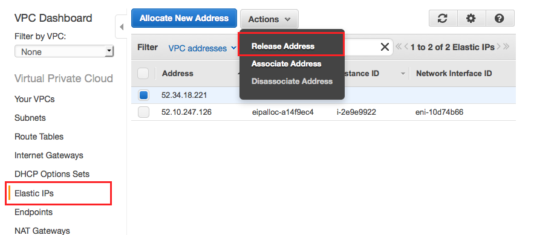

Finally, click on **Your VPCs** in the VPC Dashboard, select your VPC, and click on the **Delete** button.

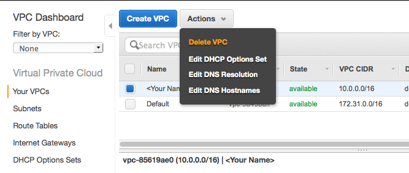

## Advanced VPC Concepts

In this section we will do an overview of two fairly new VPC features -- VPC Endpoints and VPC Flow Logs.

### VPC Flow Logs

Amazon VPC Flow Logs is a feature that enables you to capture information about the IP traffic going to and from network 
interfaces in your VPC. Flow log data is stored using Amazon CloudWatch Logs. After you\'ve created a flow log, you can 
view and retrieve its data in Amazon CloudWatch Logs.

Flow logs can help you with a number of tasks; for example, troubleshooting why specific traffic is not reaching an 
instance, which in turn can help you diagnose overly restrictive security group rules. You can also use flow logs as a 
security tool to monitor the traffic that is reaching your instance.

There is no additional charge for using flow logs; however, standard CloudWatch Logs charges apply.

Flow Logs can be created for Network Interfaces, Subnets and VPCs.

### Creating Flow Logs for a Subnet

Follow the below steps to create a flow log for your VPC:

**Step 1.** Go to your VPC Dashboard

**Step 2**. Select Subnets

**Step 3**. Select the Subnet hat you would like to create a Flow Log for

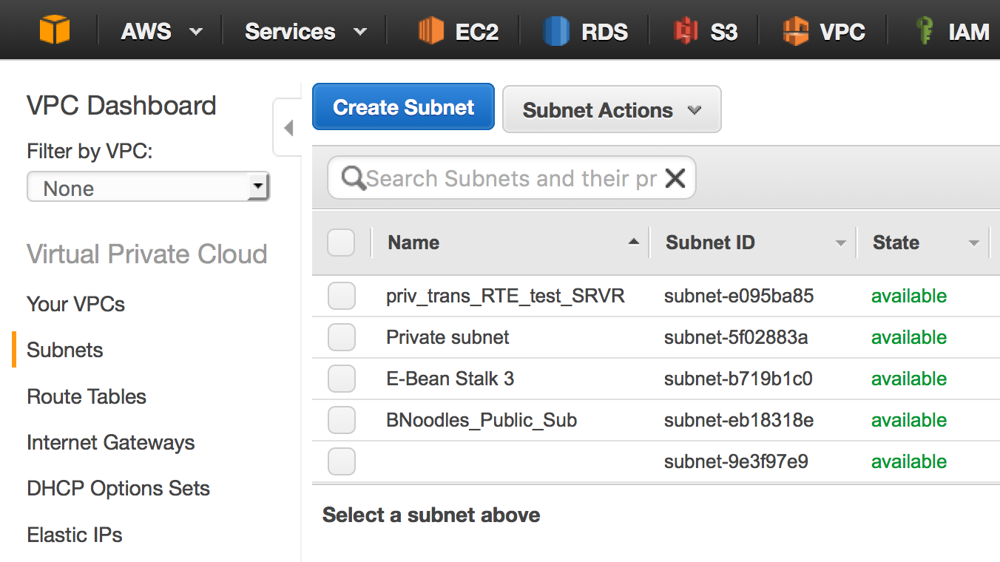

**Step 4.** Click the Action button and select Create Flow Log from the drop down menu it produces

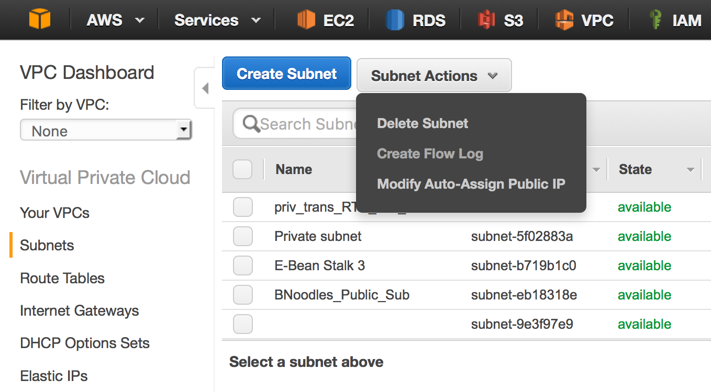

**Step 4.** Fill out the screen that follows. Select your "Filter", then chose the IAM Role you created for the 
destination "Cloud Watch Account".

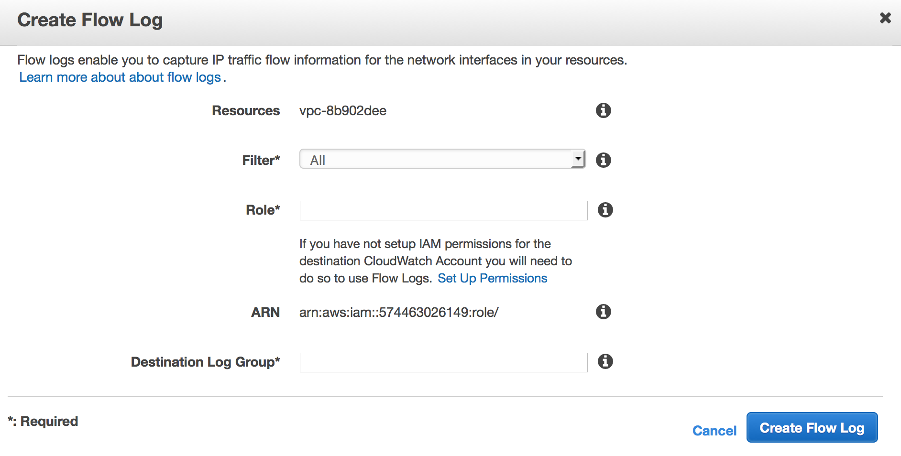

### Creating Flow Logs for a VPC

Follow the below steps to create a flow log for your VPC:

**Step 1.** Go to your VPC Dashboard

**Step 2.** Select the VPC that you would like to create a Flow Log for

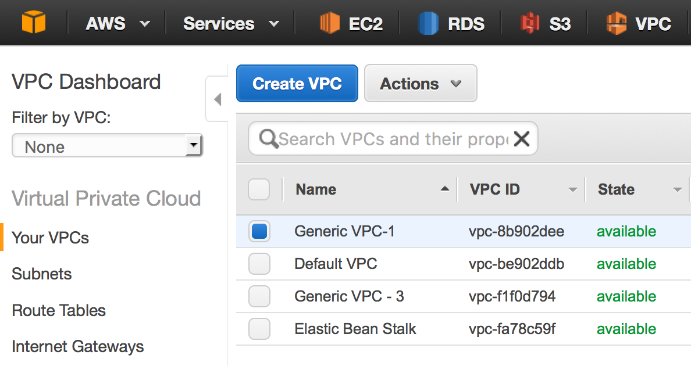

**Step 3**. Click the Action button and select Create Flow Log from the
drop down menu it produces

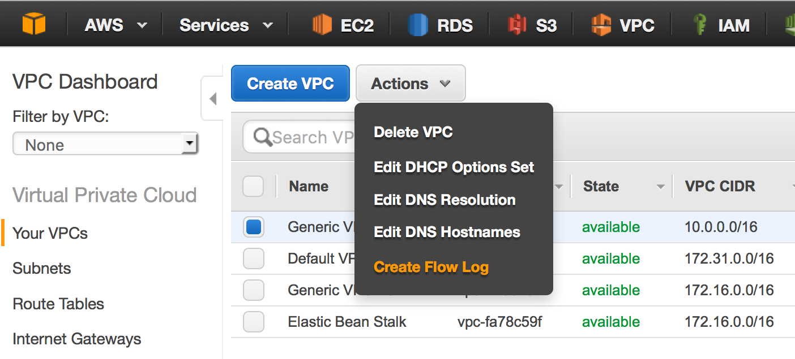

**Step 4**. Fill out the screen that follows. Select your "Filter", then
chose the IAM Role you created for the destination "Cloud Watch
Account".

### Creating Flow Logs for a Network Interface

Follow the below steps to create a Flow Log for a Network Interface:

**Step 1**. Go to your EC2 Dashboard

**Step 2**. Select Network Interfaces (It is located in the menu on the left hand side of he screen, under Network & 
Security

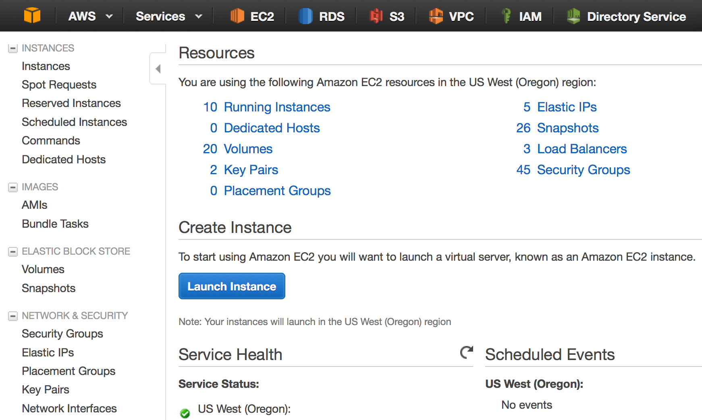

**Step 3**. Select the Network Interface that you would like to create a Flow Log for, then select Actions and Create 
Flow Log from the drop down menu

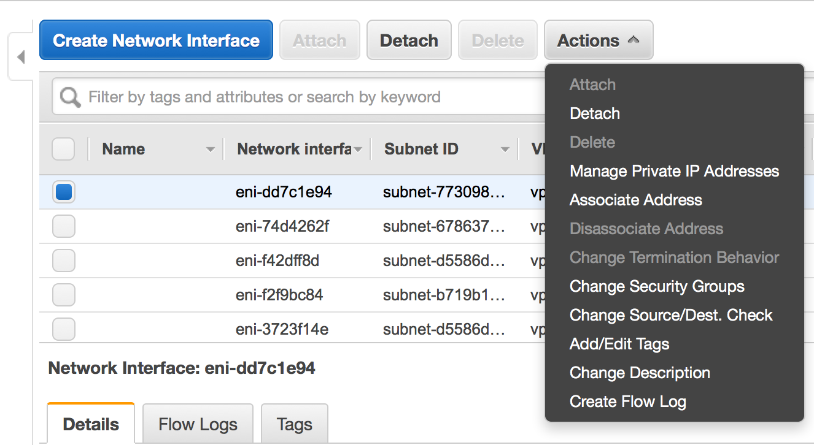

Step 4. Fill out the screen that follows. Select your "Filter", then chose the IAM Role you created for the destination 
"Cloud Watch Account".

### VPC Endpoints

A VPC endpoint enables you to create a private connection between your VPC and another AWS service (such as S3) without 
requiring access over the Internet, through a NAT instance, NAT instance Gateway, a VPN connection, or AWS Direct Connect. 
An endpoint enables instances in your VPC to use their private IP addresses to communicate with resources in those services. 
We won't go into depth in this lab about endpoints, but it is worth noting that you use endpoint policies to control access 
to resources in other services. Traffic between your VPC and the AWS service does not leave the Amazon network.

Today, we support Endpoints for connections with Amazon S3 within the same region only. We\'ll add support for other AWS 
services later.

Follow the below steps to create an Endpoint inside your VPC that is attached to one or more Route Tables.

**Step 1.** In the VPC Console, on the left most menu, select Endpoints

**Step 2.** Select Create Endpoint

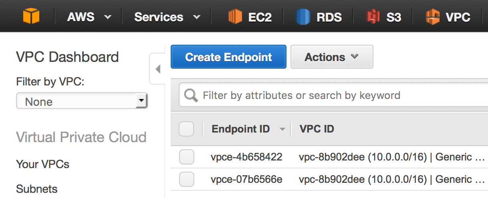

**Step 3.** Specify the VPC and the service to which you\'re connecting, for example VPC x.x.x.x/x will be connecting to 
VPC Endpoints for Amazon S3. You will also be required to specify an Endpoint Policy. This determines the type of access 
your users or resources inside your VPC will have to the intend service like S3. You can select Full Access or write a 
custom policy using JSON.

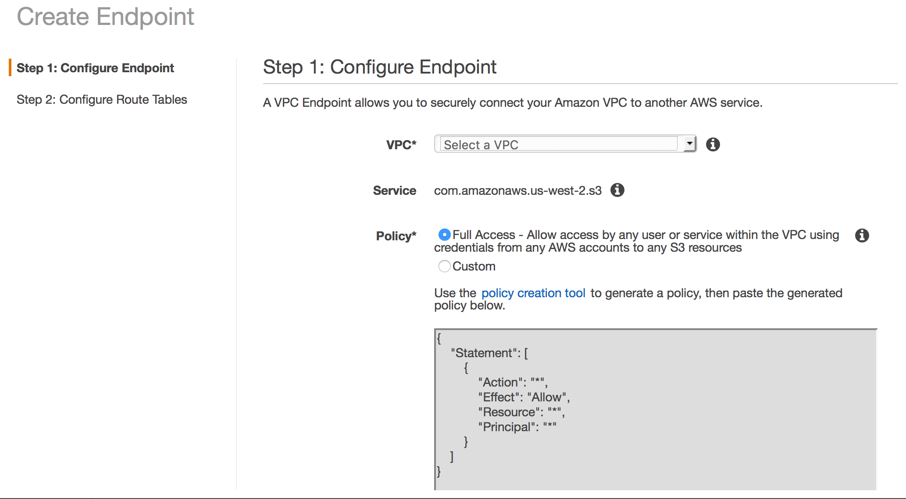

Once finish, select

**Step 4.** To control the routing of traffic between your VPC and the other service, you can specify one or more route 
tables that are used by the VPC to reach the endpoint. Then Select "Create Endpoint"

An endpoint route is automatically added to the route table, with a destination of pl-1a2b3c4d (let's assume this 
represents Amazon S3 given that S3 is the only Endpoint that exist today). Now, any traffic from the subnet that\'s 
destined for Amazon S3 in the same region goes to the endpoint, and does not go to the Internet gateway. All other 
Internet traffic goes to your Internet gateway, including traffic that\'s destined for other services, and destined for 
Amazon S3 in other regions.

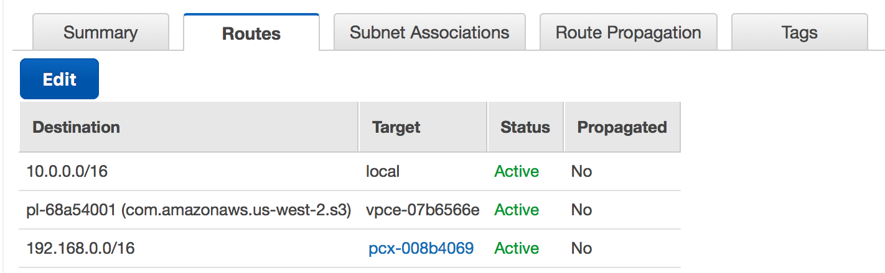

